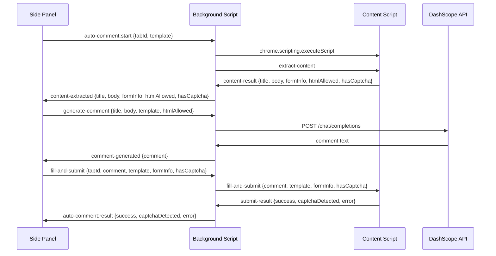

# 自动评论功能 — 设计文档

## 概述

本设计为现有 Backlinks CSV Importer Chrome 扩展新增"自动评论"功能。该功能通过 Side Panel UI 触发，编排一条完整的流水线：注入 Content Script → 提取博客文章内容 → 检测评论表单 → 调用通义千问 AI 生成评论 → 自动填充并提交表单。

核心设计决策：
- **消息传递架构**：Side Panel → Background Script（中继） → Content Script，反向亦然。使用 `chrome.scripting.executeScript` 注入 Content Script，`chrome.tabs.sendMessage` / `chrome.runtime.sendMessage` 进行通信。
- **AI 接口**：使用通义千问 DashScope OpenAI 兼容 API（`qwen-plus` 模型），通过 Background Script 的 `fetch` 调用（避免 Content Script 的 CORS 限制）。
- **表单检测策略**：按优先级瀑布式检测 WordPress → 通用表单 → 富文本编辑器 → 失败。
- **CAPTCHA 处理**：检测到 CAPTCHA 时填充所有非验证码字段，不自动提交，提示用户手动完成。

## 架构



### 模块职责

| 模块 | 文件 | 职责 |
|------|------|------|
| Auto Comment Orchestrator | `src/auto-comment.ts` | 编排完整流程，管理状态机，更新 UI 进度 |
| AI Comment Generator | `src/ai-comment-generator.ts` | 构建 prompt、调用 DashScope API、解析响应 |
| Content Script | `src/content-script.ts` | DOM 操作：提取文章、检测表单、填充字段、提交表单 |
| Background Script | `src/background.ts`（扩展） | 消息中继、Content Script 注入、AI API 调用代理 |
| Side Panel | `src/sidepanel.ts`（扩展） | API Key 设置 UI、自动评论按钮、状态显示 |

## 组件与接口

### 消息类型定义

```typescript
/** 评论表单类型 */
type CommentFormType = 'wordpress' | 'generic' | 'richtext' | 'none';

/** 表单检测结果 */
interface CommentFormInfo {
  formType: CommentFormType;
  hasNameField: boolean;
  hasEmailField: boolean;
  hasUrlField: boolean;
  hasCaptcha: boolean;
  htmlAllowed: boolean;
}

/** Content Script 提取结果 */
interface ContentExtractionResult {
  success: boolean;
  title?: string;
  body?: string;
  formInfo?: CommentFormInfo;
  error?: string;
}

/** AI 生成请求参数 */
interface GenerateCommentParams {
  title: string;
  body: string;
  template: LinkTemplate;
  htmlAllowed: boolean;
}

/** AI 生成结果 */
interface GenerateCommentResult {
  success: boolean;
  comment?: string;
  error?: string;
}

/** 填充提交请求参数 */
interface FillAndSubmitParams {
  comment: string;
  template: LinkTemplate;
  formInfo: CommentFormInfo;
}

/** 填充提交结果 */
interface FillAndSubmitResult {
  success: boolean;
  captchaDetected: boolean;
  error?: string;
}


/** Background Script 消息协议 */
type MessageAction =
  | 'auto-comment:start'
  | 'extract-content'
  | 'content-result'
  | 'generate-comment'
  | 'comment-generated'
  | 'fill-and-submit'
  | 'submit-result'
  | 'auto-comment:result';

interface Message {
  action: MessageAction;
  payload: unknown;
}
```

### auto-comment.ts — 编排器

```typescript
/**
 * 初始化自动评论模块，绑定按钮事件和消息监听
 */
export function initAutoComment(): void;

/**
 * 执行自动评论完整流程
 * 1. 校验前置条件（已选模板、已配置 API Key）
 * 2. 获取活动标签页
 * 3. 注入 Content Script 并提取内容
 * 4. 调用 AI 生成评论
 * 5. 发送填充提交指令
 * 6. 处理结果（成功/CAPTCHA/失败）
 */
async function runAutoComment(): Promise<void>;

/**
 * 更新 Side Panel 状态区域文本和样式
 */
function updateStatus(text: string, type: 'info' | 'success' | 'warning' | 'error'): void;

/**
 * 获取当前选中的 LinkTemplate
 */
function getSelectedTemplate(): LinkTemplate | null;

/**
 * 从 chrome.storage.local 加载 API Key
 */
async function loadApiKey(): Promise<string | null>;
```

### ai-comment-generator.ts — AI 评论生成

```typescript
const DASHSCOPE_ENDPOINT = 'https://dashscope.aliyuncs.com/compatible-mode/v1/chat/completions';
const MODEL = 'qwen-plus';

/**
 * 构建 system prompt
 * 根据 htmlAllowed 参数决定是否指示 AI 使用 <a href> 标签
 */
export function buildSystemPrompt(htmlAllowed: boolean): string;

/**
 * 构建 user prompt
 * 包含文章标题、正文摘要、外链模板信息
 */
export function buildUserPrompt(title: string, body: string, template: LinkTemplate): string;

/**
 * 调用 DashScope API 生成评论
 * - 使用 OpenAI 兼容格式
 * - 处理 401/429/网络错误
 * - 返回 GenerateCommentResult
 */
export async function generateComment(
  params: GenerateCommentParams,
  apiKey: string
): Promise<GenerateCommentResult>;
```

### content-script.ts — 内容脚本

```typescript
/**
 * 提取文章标题
 * 优先 h1，回退 document.title
 */
function extractTitle(): string;

/**
 * 提取文章正文
 * 优先 article → .post-content → .entry-content → main → body
 * 去除 HTML 标签，截断为 2000 字符
 */
function extractBody(): string;

/**
 * 检测评论表单类型和字段
 * 按优先级：WordPress → 通用表单 → 富文本编辑器 → none
 */
function detectCommentForm(): CommentFormInfo;

/**
 * 检测页面是否存在 CAPTCHA
 */
function detectCaptcha(): boolean;

/**
 * 检测页面是否允许 HTML 评论
 */
function detectHtmlAllowed(): boolean;

/**
 * 填充评论表单字段
 * 每个字段填充后触发 input + change 事件
 */
function fillForm(comment: string, template: LinkTemplate, formInfo: CommentFormInfo): void;

/**
 * 提交评论表单
 * 仅在无 CAPTCHA 时自动点击提交按钮
 */
function submitForm(formInfo: CommentFormInfo): void;
```

### background.ts — 扩展消息中继

在现有 `background.ts` 中新增：

```typescript
/**
 * 监听 Side Panel 消息，根据 action 分发：
 * - 'extract-content': 注入 content-script 并转发
 * - 'generate-comment': 调用 AI API 并返回结果
 * - 'fill-and-submit': 转发到 Content Script
 */
chrome.runtime.onMessage.addListener((message, sender, sendResponse) => { ... });
```

### sidepanel.ts / sidepanel.html — UI 扩展

新增 HTML 元素：
- `#settings-btn`：设置按钮（⚙️）
- `#api-key-section`：API Key 配置区域（密码输入框 + 保存按钮）
- `#auto-comment-btn`：自动评论按钮
- `#auto-comment-status`：状态显示区域

## 数据模型

### 存储结构

| Key | 类型 | 说明 |
|-----|------|------|
| `dashscopeApiKey` | `string` | 通义千问 API 密钥，存储在 `chrome.storage.local` |
| `linkTemplates` | `string`（JSON） | 已有，外链模板列表 |
| `backlinks` | `string`（JSON） | 已有，外链记录列表 |

### DashScope API 请求格式

```json
{
  "model": "qwen-plus",
  "messages": [
    { "role": "system", "content": "<system prompt>" },
    { "role": "user", "content": "<user prompt with article + template>" }
  ]
}
```

### DashScope API 响应格式

```json
{
  "choices": [
    {
      "message": {
        "role": "assistant",
        "content": "<generated comment>"
      }
    }
  ]
}
```

### 评论表单检测选择器

| 表单类型 | 检测选择器 | 字段映射 |
|----------|-----------|----------|
| WordPress | `#commentform` 或 `#respond` | comment: `#comment textarea`, name: `input[name="author"]`, email: `input[name="email"]`, url: `input[name="url"]` |
| 通用表单 | `form` 包含 `textarea` + submit 按钮 | comment: `textarea`, name/email: `input[type="text"]` / `input[type="email"]` |
| 富文本编辑器 | `div[contenteditable="true"]` | comment: contenteditable div, submit: 含 "Publish" 文本的按钮 |

### CAPTCHA 检测信号

- CSS class 包含 `captcha`、`recaptcha`、`hcaptcha`、`g-recaptcha`
- `iframe[src*="captcha"]` 或 `iframe[src*="recaptcha"]`
- `input` 或 `label` 文本包含 `captcha`、`验证码`、`確認碼`

### HTML 允许检测信号

页面文本包含以下任一：
- "可以使用的 HTML 标签"
- "You may use these HTML tags"
- "allowed HTML tags"
- "HTML tags and attributes"


## 正确性属性（Correctness Properties）

*属性（Property）是指在系统所有合法执行中都应成立的特征或行为——本质上是对系统应做什么的形式化陈述。属性是人类可读规格说明与机器可验证正确性保证之间的桥梁。*

### Property 1: 表单检测优先级

*For any* HTML 文档同时包含多种评论表单信号（WordPress 选择器、通用 form+textarea、contenteditable div），`detectCommentForm` 应返回最高优先级的表单类型（WordPress > generic > richtext），且正确识别该类型对应的所有字段（评论区、姓名、邮箱、网址字段的存在性）。

**Validates: Requirements 3.1, 3.2, 3.3, 3.4**

### Property 2: CAPTCHA 检测准确性

*For any* HTML 文档，`detectCaptcha` 应在且仅在文档包含 CAPTCHA 信号（class 含 captcha/recaptcha/hcaptcha/g-recaptcha、iframe src 含 captcha、input/label 文本含 captcha/验证码）时返回 `true`。

**Validates: Requirements 3.6**

### Property 3: HTML 允许检测准确性

*For any* HTML 文档，`detectHtmlAllowed` 应在且仅在文档包含 HTML 允许提示文本（"可以使用的 HTML 标签"、"You may use these HTML tags"、"allowed HTML tags"、"HTML tags and attributes"）时返回 `true`。

**Validates: Requirements 3.7**

### Property 4: 文章标题提取优先级

*For any* HTML 文档，`extractTitle` 应优先返回 `h1` 标签的文本内容；当 `h1` 不存在时，回退到 `document.title`。

**Validates: Requirements 4.1**

### Property 5: 文章正文提取不变量

*For any* HTML 文档，`extractBody` 返回的结果应满足：(a) 不包含任何 HTML 标签（纯文本），(b) 长度不超过 2000 个字符。

**Validates: Requirements 4.3, 4.4**

### Property 6: Prompt 链接格式与 htmlAllowed 一致性

*For any* `GenerateCommentParams`，当 `htmlAllowed` 为 `true` 时，构建的 prompt 应包含 `<a href=` 格式指令；当 `htmlAllowed` 为 `false` 时，prompt 不应包含 `<a href=` 格式指令，而应指示纯文本提及。

**Validates: Requirements 5.4, 5.5**

### Property 7: API 请求格式正确性

*For any* 有效的 `GenerateCommentParams` 和 API Key，`generateComment` 构建的请求体应包含 `model: "qwen-plus"`、`messages` 数组（含 system 和 user 两条消息）、以及 `Authorization: Bearer {apiKey}` header。

**Validates: Requirements 5.2, 5.3**

### Property 8: API 响应解析

*For any* 符合 OpenAI 格式的有效 JSON 响应，`generateComment` 应正确提取 `choices[0].message.content` 作为评论文本返回。

**Validates: Requirements 5.6**

### Property 9: API 错误映射

*For any* HTTP 错误状态码（401、429、500 等）或网络错误，`generateComment` 应返回 `{ success: false, error: <描述性错误信息> }`，且错误信息应包含具体的错误类型描述。

**Validates: Requirements 5.7**

### Property 10: 表单填充完整性

*For any* 评论文本、LinkTemplate 和 CommentFormInfo，`fillForm` 应将评论文本填入评论字段，将 template.name 填入姓名字段（如存在），将 template.url 填入网址字段（如存在）。对于富文本编辑器类型，应使用 innerHTML 设置内容。

**Validates: Requirements 6.1, 6.2, 6.3, 6.5**

### Property 11: 填充后事件触发

*For any* 字段填充操作，填充后应在该字段上触发 `input` 和 `change` 两个事件。

**Validates: Requirements 6.4**

### Property 12: CAPTCHA 条件提交

*For any* 已填充的评论表单，当 `hasCaptcha` 为 `false` 时应自动点击提交按钮；当 `hasCaptcha` 为 `true` 时不应触发提交。

**Validates: Requirements 7.1, 7.2**

### Property 13: API Key 存取往返

*For any* 非空字符串作为 API Key，保存到 `chrome.storage.local` 后再加载，应得到相同的字符串。

**Validates: Requirements 2.4**

### Property 14: 空 API Key 拒绝

*For any* 仅由空白字符组成的字符串，尝试保存为 API Key 时应被拒绝，存储中的值不应改变。

**Validates: Requirements 2.6**

### Property 15: 流程完成后按钮恢复

*For any* 自动评论流程执行（无论成功、失败或 CAPTCHA），流程结束后"自动评论"按钮应恢复为可用状态（disabled = false）。

**Validates: Requirements 8.6**

## 错误处理

| 错误场景 | 处理方式 | 用户提示 |
|----------|---------|---------|
| 未选择外链模板 | 中止流程 | "请先选择一个外链模板" |
| API Key 未配置 | 中止流程 | "请先在设置中配置 API Key" |
| API Key 为空保存 | 阻止保存 | "API Key 不能为空" |
| 未检测到评论表单 | 中止流程 | "未检测到评论表单" |
| 未能提取文章内容 | 中止流程 | "未能提取文章内容" |
| DashScope API 401 | 中止流程 | "API Key 无效，请检查设置" |
| DashScope API 429 | 中止流程 | "API 调用频率超限，请稍后重试" |
| DashScope API 网络错误 | 中止流程 | "网络错误，请检查网络连接" |
| 标签页通信失败 | 中止流程 | "无法与页面通信，请刷新页面后重试" |
| 检测到 CAPTCHA | 填充但不提交 | "检测到验证码，请手动完成验证码并提交"（黄色警告） |
| 提交成功 | 流程完成 | "评论已提交"（绿色成功） |

所有错误均通过 `updateStatus(text, type)` 在 Side Panel 状态区域显示，type 决定颜色：
- `error` → 红色
- `warning` → 黄色
- `success` → 绿色
- `info` → 默认色（进度信息）

## 测试策略

### 测试框架

- **单元测试**：Jest（已配置，111 个现有测试通过）
- **属性测试**：fast-check（已安装在 devDependencies）
- **测试环境**：`jest-environment-jsdom`（用于 DOM 相关测试）

### 属性测试配置

- 每个属性测试最少运行 **100 次迭代**
- 每个属性测试必须用注释标注对应的设计属性
- 标注格式：`/** Feature: auto-comment, Property {number}: {property_text} */`
- 每个正确性属性由**单个**属性测试实现

### 测试文件规划

| 测试文件 | 测试类型 | 覆盖模块 |
|----------|---------|---------|
| `__tests__/content-script.test.ts` | 属性测试 + 单元测试 | extractTitle, extractBody, detectCommentForm, detectCaptcha, detectHtmlAllowed, fillForm |
| `__tests__/ai-comment-generator.test.ts` | 属性测试 + 单元测试 | buildSystemPrompt, buildUserPrompt, generateComment |
| `__tests__/auto-comment.test.ts` | 单元测试 | 流程编排、错误处理、UI 状态管理 |

### 属性测试与单元测试分工

**属性测试**（fast-check）— 验证普遍性质：
- Property 1–15 的所有正确性属性
- 使用 `fc.string()`、`fc.boolean()`、自定义 HTML 生成器等 arbitrary 生成随机输入

**单元测试**（Jest）— 验证具体示例和边界情况：
- Manifest 权限检查（Requirements 1.1–1.3）
- UI 元素存在性检查（Requirements 2.1–2.3, 8.1, 10.3）
- 特定错误消息验证（Requirements 5.8, 8.4, 9.6）
- CAPTCHA 警告和成功消息的 UI 状态（Requirements 7.3, 7.4, 10.4–10.6）
- 流程执行顺序和按钮禁用状态（Requirements 8.2, 8.3）
- 空内容提取错误（Requirements 4.5）
