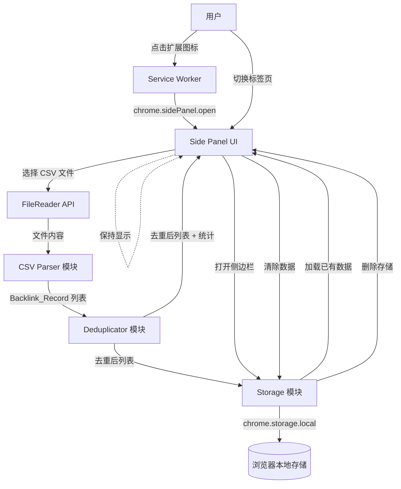

# 技术设计文档：Backlinks CSV Importer Extension

## 概述

本设计文档描述一个 Chrome 浏览器扩展插件的技术架构，该插件用于导入、解析、去重和展示 CSV 格式的外链（Backlinks）数据。插件采用 Chrome Extension Manifest V3 架构，使用 Chrome Side Panel API（`chrome.sidePanel`）作为主要交互界面，侧边栏固定显示在浏览器右侧，切换标签页时不会关闭。通过 `chrome.storage.local` 实现数据持久化。

核心数据流：用户点击扩展图标 → 打开侧边栏 → 选择 CSV 文件 → 解析为结构化记录 → 去重处理 → 存储并展示。

### 设计决策

1. **Manifest V3**：Chrome 已弃用 Manifest V2，新扩展必须使用 V3。
2. **Side Panel（替代 Popup）**：使用 Chrome Side Panel API 替代 Popup 页面。Side Panel 固定在浏览器右侧，切换标签页时保持打开状态，用户可以在浏览不同网页时持续查看外链数据。Popup 在切换标签页或点击外部区域时会自动关闭，不适合需要持续查看的场景。Side Panel 需要 Chrome 114+ 版本支持。
3. **PapaParse 库**：CSV 解析使用成熟的 PapaParse 库，处理引号、逗号转义等边界情况，避免手写解析器的 bug。
4. **chrome.storage.local**：相比 localStorage，支持更大存储容量（可达 10MB+），且原生支持异步操作。
5. **纯 JavaScript + HTML/CSS**：插件功能简单，无需引入 React/Vue 等框架，减少打包体积。
6. **Service Worker 控制图标行为**：通过 `chrome.action.onClicked` 监听扩展图标点击事件，在 Service Worker 中调用 `chrome.sidePanel.open()` 打开侧边栏，实现点击图标切换侧边栏的交互。

## 架构



### 模块职责

| 模块 | 职责 |
|------|------|
| Service Worker | 监听扩展图标点击事件，调用 `chrome.sidePanel.open()` 打开侧边栏 |
| Side Panel UI | 文件选择、进度显示、统计摘要、表格展示、排序交互、清除确认（固定在浏览器右侧，切换标签页不关闭） |
| CSV Parser | 解析 CSV 内容、跳过表头、拆分字段、解析子字段、类型转换、错误记录 |
| Deduplicator | URL 标准化、基于源页面 URL + 目标 URL 去重、保留最新记录 |
| Storage | chrome.storage.local 读写封装、新旧数据合并 |

## 组件与接口

### CSV Parser 模块

```typescript
// csv-parser.ts

interface ParseResult {
  records: BacklinkRecord[];
  failedRows: number;
  totalRows: number;
}

/**
 * 解析 CSV 文件内容，返回结构化的外链记录列表
 * - 使用 PapaParse 解析 CSV
 * - 跳过表头行
 * - 忽略"内部链接"字段（第4列，索引3）
 * - 解析失败的行计入 failedRows
 */
function parseCSV(csvContent: string): ParseResult;

/**
 * 解析"源页面标题和 URL"字段
 * 格式: "URL | 页面类型 | 语言代码 | 移动友好"（后三项可选）
 */
function parseSourcePageInfo(field: string): SourcePageInfo;

/**
 * 解析"锚链接和目标 URL"字段
 * 格式: "目标URL | 链接类型 | 属性1 | 属性2 | ..."
 */
function parseAnchorInfo(field: string): AnchorInfo;

/**
 * 解析日期字段
 * 支持: "2026年2月8日"（绝对日期）和 "12 天前"（相对日期）
 */
function parseDate(dateStr: string): Date;
```

### Deduplicator 模块

```typescript
// deduplicator.ts

interface DeduplicationResult {
  records: BacklinkRecord[];
  removedCount: number;
}

/**
 * 对外链记录列表进行去重
 * - 唯一键: normalizeUrl(sourceUrl) + normalizeUrl(targetUrl)
 * - 重复时保留"上次发现日期"最新的记录
 */
function deduplicate(records: BacklinkRecord[]): DeduplicationResult;

/**
 * URL 标准化
 * - 移除尾部斜杠
 * - 统一为 https 协议
 * - 对查询参数按字母排序
 */
function normalizeUrl(url: string): string;
```

### Storage 模块

```typescript
// storage.ts

/**
 * 保存外链记录到 chrome.storage.local
 * 序列化为 JSON 格式
 */
async function saveRecords(records: BacklinkRecord[]): Promise<void>;

/**
 * 从 chrome.storage.local 加载已保存的外链记录
 * 反序列化 JSON 为 BacklinkRecord 列表
 */
async function loadRecords(): Promise<BacklinkRecord[]>;

/**
 * 清除所有已保存的外链记录
 */
async function clearRecords(): Promise<void>;

/**
 * 合并新数据与已有数据，并执行去重
 */
async function mergeAndSave(newRecords: BacklinkRecord[]): Promise<DeduplicationResult>;
```

### Side Panel UI

```typescript
// sidepanel.ts

/**
 * 初始化 Side Panel 页面
 * - 加载已有数据并展示
 * - 绑定导入按钮、清除按钮事件
 * - 侧边栏在切换标签页时保持状态不重置
 */
function init(): Promise<void>;

/**
 * 处理文件导入流程
 * - 读取文件 → 解析 → 去重 → 存储 → 展示
 */
function handleImport(file: File): Promise<void>;

/**
 * 渲染表格数据
 * - 支持按列排序（升序/降序切换）
 * - 默认按页面 AS 降序
 */
function renderTable(records: BacklinkRecord[], sortColumn: string, sortOrder: 'asc' | 'desc'): void;

/**
 * 渲染导入统计摘要
 */
function renderSummary(result: ImportResult): void;
```

### Service Worker（Background Script）

```typescript
// background.ts

/**
 * 监听扩展图标点击事件
 * - 点击时调用 chrome.sidePanel.open() 打开侧边栏
 * - 需要先通过 chrome.sidePanel.setPanelBehavior 设置行为
 */
chrome.action.onClicked.addListener(async (tab) => {
  await chrome.sidePanel.open({ tabId: tab.id });
});

/**
 * 设置 Side Panel 行为
 * - openPanelOnActionClick: true 表示点击扩展图标时自动打开侧边栏
 */
chrome.sidePanel.setPanelBehavior({ openPanelOnActionClick: true });
```

### Manifest V3 配置

```json
{
  "manifest_version": 3,
  "name": "Backlinks CSV Importer",
  "version": "1.0",
  "permissions": ["storage", "sidePanel"],
  "side_panel": {
    "default_path": "sidepanel.html"
  },
  "background": {
    "service_worker": "background.js"
  },
  "icons": {
    "16": "icons/icon16.png",
    "48": "icons/icon48.png",
    "128": "icons/icon128.png"
  }
}
```

## 数据模型

```typescript
/** 单条外链记录（不包含内部链接字段） */
interface BacklinkRecord {
  pageAS: number;              // 页面权威分数，整数
  sourcePageInfo: SourcePageInfo;  // 源页面信息
  externalLinks: number;       // 外部链接数，整数
  anchorInfo: AnchorInfo;      // 锚链接和目标 URL 信息
  firstSeenDate: string;       // 首次发现日期，ISO 8601 格式
  lastSeenDate: string;        // 上次发现日期，ISO 8601 格式
}

/** 源页面信息 */
interface SourcePageInfo {
  url: string;                 // 源页面 URL（必填）
  pageType?: string;           // 页面类型：博客、CMS、留言板等（可选）
  language?: string;           // 语言代码：EN、FR、ZH、KO、RU 等（可选）
  mobileFriendly?: boolean;    // 是否移动友好（可选）
}

/** 锚链接信息 */
interface AnchorInfo {
  targetUrl: string;           // 目标 URL
  linkType?: string;           // 链接类型：文本、图片
  attributes: string[];        // 链接属性列表：Nofollow、UGC、内容、新增、页脚等
}

/** 导入结果统计 */
interface ImportResult {
  totalRows: number;           // CSV 总行数（不含表头）
  successCount: number;        // 成功解析的记录数
  duplicateCount: number;      // 去重移除的记录数
  failedCount: number;         // 解析失败的行数
}
```

### 存储格式

数据以 JSON 格式存储在 `chrome.storage.local` 中：

```json
{
  "backlinks": [
    {
      "pageAS": 14,
      "sourcePageInfo": {
        "url": "https://example.com/page",
        "pageType": "博客",
        "language": "EN",
        "mobileFriendly": true
      },
      "externalLinks": 50,
      "anchorInfo": {
        "targetUrl": "https://crazycattle3d.io/",
        "linkType": "文本",
        "attributes": ["Nofollow"]
      },
      "firstSeenDate": "2025-12-15",
      "lastSeenDate": "2026-02-15"
    }
  ]
}
```

## 正确性属性（Correctness Properties）

*属性（Property）是指在系统所有有效执行中都应保持为真的特征或行为——本质上是对系统应做什么的形式化陈述。属性是人类可读规范与机器可验证正确性保证之间的桥梁。*

### 属性 1：CSV 行解析正确性

*对于任意*包含 7 个字段的有效 CSV 数据行，解析后应产生一个 BacklinkRecord 对象，其中 pageAS 和 externalLinks 为整数类型，且不包含"内部链接"字段的数据（仅保留 6 个字段）。

**验证需求：2.2, 2.7**

### 属性 2：源页面信息解析正确性

*对于任意*包含 ` | ` 分隔符的源页面信息字符串，解析后应正确提取 URL（必填）、页面类型、语言代码、移动友好属性（均为可选），且提取的 URL 应为有效的 URL 格式。

**验证需求：2.3**

### 属性 3：锚链接信息解析正确性

*对于任意*包含 ` | ` 分隔符的锚链接信息字符串，解析后应正确提取目标 URL、链接类型和链接属性列表，且所有通过分隔符拆分的部分都应被正确归类。

**验证需求：2.4**

### 属性 4：日期解析正确性

*对于任意*有效的中文绝对日期字符串（如"YYYY年M月D日"格式）或相对日期字符串（如"N 天前"格式），解析后应产生一个有效的日期值，且绝对日期的年、月、日应与原始字符串中的数值一致。

**验证需求：2.5**

### 属性 5：去重正确性

*对于任意* BacklinkRecord 列表，去重后的结果中不应存在两条记录具有相同的标准化（源页面 URL, 目标 URL）组合；且对于原始列表中具有相同标准化 URL 组合的记录组，去重后保留的记录应是该组中"上次发现日期"最新的那条。

**验证需求：3.1, 3.2**

### 属性 6：URL 标准化幂等性

*对于任意* URL 字符串，执行两次标准化处理的结果应与执行一次标准化处理的结果完全相同（即 `normalizeUrl(normalizeUrl(url)) === normalizeUrl(url)`）。

**验证需求：3.3**

### 属性 7：去重计数不变量

*对于任意* BacklinkRecord 列表，去重后的记录数加上被移除的重复记录数应等于原始列表的记录数（即 `result.records.length + result.removedCount === input.length`）。

**验证需求：3.4**

### 属性 8：排序正确性

*对于任意* BacklinkRecord 列表和任意可排序列，按该列升序排序后，列表中每个相邻元素对应满足 `list[i] <= list[i+1]`；按降序排序后满足 `list[i] >= list[i+1]`。

**验证需求：4.4**

### 属性 9：合并去重正确性

*对于任意*已有 BacklinkRecord 列表和新导入的 BacklinkRecord 列表，合并并去重后的结果应等价于将两个列表拼接后执行去重的结果。

**验证需求：5.3**

### 属性 10：序列化往返一致性

*对于任意*有效的 BacklinkRecord 列表，将其序列化为 JSON 后再反序列化，应产生与原始列表深度相等的对象。

**验证需求：5.1, 5.2, 7.1, 7.2, 7.3**

### 属性 11：清除操作正确性

*对于任意*已存储的 BacklinkRecord 列表，执行清除操作后，加载存储应返回空列表；若取消清除操作，加载存储应返回与清除前完全相同的列表。

**验证需求：6.2, 6.3**

> **关于需求 8（侧边栏固定显示）的说明**：需求 8 的验收标准主要涉及 Chrome Side Panel API 的配置和内置行为（如切换标签页保持显示、点击图标切换侧边栏），这些是浏览器平台行为而非应用逻辑，不适合用属性测试验证。侧边栏中的功能正确性已被属性 1-11 完全覆盖。需求 8 的可测试项（8.1 图标点击打开侧边栏、8.4 manifest.json 配置）通过单元测试/示例测试覆盖。

## 错误处理

| 错误场景 | 处理方式 | 用户提示 |
|----------|---------|---------|
| 文件非 CSV 格式 | 阻止读取，不调用解析器 | "请选择有效的 CSV 文件" |
| CSV 行字段数 ≠ 7 | 跳过该行，计入 failedRows | 导入完成后在统计摘要中显示失败数 |
| 字段内容无法解析（如 pageAS 非数字） | 跳过该行，计入 failedRows | 同上 |
| 日期格式无法识别 | 跳过该行，计入 failedRows | 同上 |
| chrome.storage.local 写入失败 | 捕获异常，保留内存数据 | "数据保存失败，请检查浏览器存储空间" |
| chrome.storage.local 读取失败 | 捕获异常，显示空列表 | "数据加载失败，请重新导入" |
| CSV 文件为空（无数据行） | 正常处理，返回空列表 | 统计摘要显示总行数为 0 |
| Side Panel API 不可用（Chrome 版本 < 114） | Service Worker 捕获异常 | 控制台输出警告，扩展图标无响应 |

### 错误处理原则

1. **不中断流程**：单行解析失败不影响其他行的解析，最终汇总报告失败数。
2. **数据不丢失**：存储失败时保留内存中的数据，用户仍可查看当前导入结果。
3. **明确反馈**：所有错误都通过 UI 向用户展示，不静默失败。

## 测试策略

### 双重测试方法

本项目采用单元测试与属性测试相结合的方式，确保全面覆盖：

- **单元测试**：验证具体示例、边界情况和错误条件
- **属性测试**：验证跨所有输入的通用属性

### 属性测试配置

- **测试库**：使用 [fast-check](https://github.com/dubzzz/fast-check) 作为属性测试库
- **最小迭代次数**：每个属性测试至少运行 100 次
- **标签格式**：每个测试用注释引用设计文档中的属性，格式为 `Feature: backlinks-csv-importer-extension, Property {number}: {property_text}`
- **一对一映射**：每个正确性属性由一个属性测试实现

### 单元测试范围

单元测试聚焦于：
- 具体的 CSV 样本数据解析示例（使用真实 CSV 文件中的行）
- 边界情况：空文件、单行文件、字段缺失、非法字符
- 错误条件：非 CSV 文件、存储失败模拟
- 文件选择对话框仅接受 `.csv` 格式（需求 1.1）
- 默认按页面 AS 降序排序（需求 4.3）
- 清除确认对话框显示（需求 6.1）
- 点击扩展图标调用 `chrome.sidePanel.open()` 打开侧边栏（需求 8.1）
- manifest.json 包含 `"sidePanel"` 权限和 `side_panel.default_path` 配置（需求 8.4）
- 侧边栏页面包含完整功能界面元素（需求 8.5）

### 属性测试范围

每个正确性属性对应一个属性测试：

| 属性 | 测试描述 | 生成器 |
|------|---------|--------|
| P1 | CSV 行解析产生正确的 BacklinkRecord | 生成包含 7 个字段的随机 CSV 行 |
| P2 | 源页面信息字段正确拆分 | 生成随机的 pipe 分隔源页面信息字符串 |
| P3 | 锚链接信息字段正确拆分 | 生成随机的 pipe 分隔锚链接信息字符串 |
| P4 | 日期解析正确 | 生成随机的中文绝对日期和相对日期字符串 |
| P5 | 去重后无重复且保留最新 | 生成包含重复记录的随机 BacklinkRecord 列表 |
| P6 | URL 标准化幂等 | 生成随机 URL（含尾部斜杠、不同协议、不同参数顺序） |
| P7 | 去重计数守恒 | 生成随机 BacklinkRecord 列表 |
| P8 | 排序结果有序 | 生成随机 BacklinkRecord 列表和随机排序列 |
| P9 | 合并等价于拼接后去重 | 生成两个随机 BacklinkRecord 列表 |
| P10 | JSON 序列化往返一致 | 生成随机 BacklinkRecord 列表 |
| P11 | 清除后为空，取消后不变 | 生成随机 BacklinkRecord 列表 |

### 测试工具

- **测试框架**：Jest
- **属性测试库**：fast-check
- **覆盖率目标**：核心模块（CSV Parser、Deduplicator、Storage）≥ 90%
