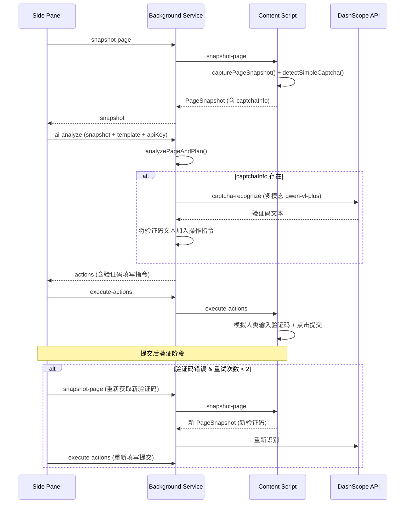

# 设计文档：验证码自动识别

## 概述

本功能为 Chrome 扩展的自动评论流程增加简单图片验证码（数字/文字类）的自动检测、AI 识别和自动填写能力。核心思路是：

1. 在页面快照阶段，Content Script 扫描页面中的简单图片验证码元素及其关联输入框
2. 将验证码图片数据（URL 或 base64）附加到 PageSnapshot 中传递给 AI Planner
3. AI Planner 在规划操作前，先调用 DashScope 多模态 API（qwen-vl-plus）识别验证码内容
4. 将识别结果作为 `type` 操作指令填入验证码输入框，然后正常提交
5. 提交失败时支持自动重试（最多 2 次）

与现有流程的关系：现有的 `hasCaptcha` 标志仅用于 reCAPTCHA/hCaptcha 等复杂验证码（提示用户手动处理）。新增的 `captchaInfo` 字段专门承载可自动识别的简单图片验证码信息，两者独立存在。

## 架构

### 整体流程



### 模块职责

| 模块 | 职责 |
|------|------|
| Content Script (`content-script.ts`) | 验证码元素检测、图片数据提取、DOM 操作 |
| AI Comment Generator (`ai-comment-generator.ts`) | 验证码识别（调用多模态 API）、操作指令规划集成 |
| Auto Comment (`auto-comment.ts`) | 验证码重试流程编排 |
| Background (`background.ts`) | `captcha-recognize` 消息路由 |
| Types (`types.ts`) | `CaptchaInfo` 类型、`PageSnapshot` 扩展 |


## 组件与接口

### 1. 验证码检测器（Captcha Detector）

位于 `content-script.ts`，在 `capturePageSnapshot()` 中调用。

```typescript
/**
 * 检测页面中的简单图片验证码
 * 返回 CaptchaInfo 或 null
 */
function detectSimpleCaptcha(): CaptchaInfo | null
```

检测策略：
- 扫描所有 `` 元素，检查 `id`、`name`、`class`、`src`、`alt` 属性是否包含关键词
- 关键词列表：`captcha`、`verify`、`验证码`、`認証`、`captcha_image`、`seccode`
- 定位关联输入框的策略（按优先级）：
  1. 同一 `<form>` 内 `name`/`id` 包含 captcha/verify/验证码 的 `<input type="text">`
  2. 验证码图片的相邻兄弟元素中的 `<input type="text">`
  3. 验证码图片父元素内的 `<input type="text">`

区分逻辑：
- reCAPTCHA/hCaptcha 通过 iframe src 或 `.g-recaptcha`/`[class*="recaptcha"]`/`[class*="hcaptcha"]` 检测，标记为复杂验证码（仅设置 `hasCaptcha = true`）
- 简单图片验证码通过 `` 元素关键词匹配检测，填充 `captchaInfo` 字段

### 2. 验证码图片数据提取

位于 `content-script.ts`，在 `detectSimpleCaptcha()` 内部调用。

```typescript
/**
 * 提取验证码图片数据
 * 优先使用 src URL，跨域时回退到 Canvas base64，最终回退到截图裁剪
 */
async function extractCaptchaImageData(imgElement: HTMLImageElement): Promise<string>
```

提取策略（按优先级）：
1. 如果 `src` 是 data URI（`data:image/...`），直接使用
2. 如果 `src` 是完整 URL 或相对路径（转为绝对 URL），直接使用 URL
3. 如果图片已加载（`complete === true` 且 `naturalWidth > 0`），使用 Canvas API 绘制并导出 base64
4. 如果 Canvas 被跨域污染（`SecurityError`），通过 Background Service 调用 `chrome.tabs.captureVisibleTab` 截取可见区域，根据图片的 `getBoundingClientRect()` 裁剪

### 3. 验证码识别器（Captcha Recognizer）

位于 `ai-comment-generator.ts`，新增独立函数。

```typescript
/**
 * 调用 DashScope 多模态 API 识别验证码图片内容
 */
export async function recognizeCaptcha(
  imageData: string,  // base64 data URI 或图片 URL
  apiKey: string
): Promise<{ success: boolean; text?: string; error?: string }>
```

实现要点：
- 使用 `qwen-vl-plus` 模型（DashScope 多模态视觉模型）
- API 端点与现有 `DASHSCOPE_ENDPOINT` 相同（OpenAI 兼容格式）
- 消息格式使用多模态 content 数组：
  ```json
  {
    "model": "qwen-vl-plus",
    "messages": [{
      "role": "user",
      "content": [
        {"type": "image_url", "image_url": {"url": "<图片URL或base64>"}},
        {"type": "text", "text": "识别这张验证码图片中的字符，只返回纯字符内容，不要任何解释。"}
      ]
    }]
  }
  ```
- 结果清洗：`result.replace(/[\s\.,;:!?'"，。；：！？、\-\(\)\[\]{}]/g, '')` 去除空格、标点等非验证码字符
- 错误处理：401 → "API Key 无效"，429 → "API 调用频率超限"，其他 → 通用错误

### 4. AI Planner 集成

修改 `analyzePageAndPlan()` 函数：

```typescript
// 在调用 AI 规划操作之前，先处理验证码
if (snapshot.captchaInfo?.type === 'simple_image') {
  const captchaResult = await recognizeCaptcha(snapshot.captchaInfo.imageData, apiKey);
  if (captchaResult.success && captchaResult.text) {
    // 识别成功：在 AI 返回的 actions 末尾（submit 之前）插入验证码填写指令
    // 并且不设置 hasCaptcha = true
  } else {
    // 识别失败：设置 hasCaptcha = true，不包含提交操作
  }
}
```

### 5. Background 消息路由

在 `background.ts` 中新增 `captcha-recognize` 消息处理：

```typescript
if (action === 'captcha-recognize') {
  const { imageData, apiKey } = payload as { imageData: string; apiKey: string };
  // 参数校验 → 调用 recognizeCaptcha → 返回结果
}
```

### 6. 验证码重试流程

修改 `auto-comment.ts` 中的 `runAutoComment()` 提交后验证循环：

- 在 `post-submit-analyze` 返回 `error` 且 message 包含验证码相关关键词时，识别为验证码错误
- 验证码错误关键词：`验证码`、`captcha`、`認証コード`、`incorrect`、`wrong code`
- 验证码重试独立计数（最多 2 次），与现有的评论内容重试（最多 3 次）分开
- 重试时重新截取快照（获取刷新后的新验证码图片）→ 重新识别 → 重新填写提交


## 数据模型

### CaptchaInfo 类型

```typescript
/** 简单图片验证码信息 */
export interface CaptchaInfo {
  imageData: string;      // 验证码图片的 base64 data URI 或可访问的 URL
  inputSelector: string;  // 验证码输入框的 CSS 选择器
  type: 'simple_image';   // 验证码类型标识
}
```

### PageSnapshot 扩展

```typescript
export interface PageSnapshot {
  // ... 现有字段保持不变
  title: string;
  bodyExcerpt: string;
  forms: { selector: string; elements: SnapshotElement[] }[];
  hasCaptcha: boolean;       // 继续标识复杂验证码（reCAPTCHA/hCaptcha）
  htmlAllowed: boolean;
  errorMessages?: string[];
  pageLang?: string;
  
  // 新增字段
  captchaInfo?: CaptchaInfo; // 简单图片验证码信息（可选）
}
```

### MessageAction 扩展

```typescript
export type MessageAction =
  | /* ...现有类型... */
  | 'captcha-recognize';  // 新增：验证码识别请求
```

### 验证码识别请求/响应

```typescript
/** captcha-recognize 消息的 payload */
interface CaptchaRecognizePayload {
  imageData: string;  // base64 data URI 或 URL
  apiKey: string;
}

/** captcha-recognize 消息的响应 */
interface CaptchaRecognizeResponse {
  success: boolean;
  text?: string;      // 识别出的验证码文本
  error?: string;     // 错误描述
}
```

### 验证码检测关键词常量

```typescript
/** 验证码图片检测关键词 */
const CAPTCHA_IMAGE_KEYWORDS = ['captcha', 'verify', 'verification', 'seccode', '验证码', '認証', 'vcode'];

/** 验证码输入框检测关键词 */
const CAPTCHA_INPUT_KEYWORDS = ['captcha', 'verify', 'verification', 'seccode', '验证码', '認証', 'vcode'];

/** 复杂验证码检测选择器（不尝试自动识别） */
const COMPLEX_CAPTCHA_SELECTORS = ['.g-recaptcha', '[class*="recaptcha"]', '[class*="hcaptcha"]', '[data-sitekey]'];

/** 验证码错误关键词（用于重试判断） */
const CAPTCHA_ERROR_KEYWORDS = ['验证码', 'captcha', '認証コード', '認証', 'verification code', 'wrong code', 'incorrect code'];
```

### 设计决策说明

1. **为什么使用 `qwen-vl-plus` 而非 `qwen-plus`**：`qwen-plus` 是纯文本模型，不支持图片输入。`qwen-vl-plus` 是通义千问的多模态视觉模型，支持 OpenAI 兼容格式的 `image_url` 输入，适合验证码图片识别。

2. **为什么 `captchaInfo` 与 `hasCaptcha` 独立存在**：`hasCaptcha` 已被现有流程用于标识"需要用户手动处理的验证码"（reCAPTCHA 等）。新增 `captchaInfo` 专门承载可自动识别的简单验证码，两者语义不同，互不干扰。

3. **为什么验证码识别在 `analyzePageAndPlan` 中而非单独步骤**：将验证码识别集成到 AI 分析阶段，可以让 AI Planner 直接获得验证码文本并将其纳入操作指令规划，避免额外的消息往返和流程复杂度。

4. **为什么验证码重试上限是 2 次**：简单图片验证码的 AI 识别准确率较高，2 次重试（共 3 次尝试）足以覆盖偶发的识别错误。过多重试可能触发网站的反爬机制。

5. **图片数据提取的多级回退策略**：不同网站的验证码图片实现方式各异（data URI、同域 URL、跨域 URL），多级回退确保在各种场景下都能获取到图片数据。


## 正确性属性

*属性（Property）是指在系统所有有效执行中都应成立的特征或行为——本质上是对系统应做什么的形式化陈述。属性是人类可读规格说明与机器可验证正确性保证之间的桥梁。*

### Property 1: 验证码图片关键词检测正确性

*For any* `` 元素，如果其 `id`、`name`、`class`、`src` 或 `alt` 属性中包含 CAPTCHA_IMAGE_KEYWORDS 列表中的任一关键词（不区分大小写），则 `detectSimpleCaptcha` 应将其识别为疑似验证码图片；如果所有属性均不包含任何关键词，则不应将其识别为验证码图片。

**Validates: Requirements 1.1, 1.5**

### Property 2: 验证码关联输入框定位

*For any* 被检测为验证码图片的 `` 元素，如果同一表单内存在 `name`/`id` 包含验证码关键词的 `<input type="text">`，或图片的相邻/父级元素中存在 `<input type="text">`，则 `detectSimpleCaptcha` 返回的 `inputSelector` 应指向该输入框；如果找不到关联输入框，则应返回 `null`。

**Validates: Requirements 1.2**

### Property 3: 简单验证码与复杂验证码独立标记

*For any* 页面 DOM，`hasCaptcha`（标识 reCAPTCHA/hCaptcha 等复杂验证码）和 `captchaInfo`（标识简单图片验证码）应独立判定：页面可以同时有 `hasCaptcha=true` 和 `captchaInfo` 存在，也可以只有其中之一，也可以两者都没有。两个字段的值不应相互影响。

**Validates: Requirements 1.4, 6.3**

### Property 4: 图片数据提取格式有效性

*For any* 验证码图片元素，`extractCaptchaImageData` 返回的字符串必须是以 `data:image/` 开头的 data URI 或以 `http://`/`https://` 开头的绝对 URL。如果原始 `src` 是相对路径，返回值必须是转换后的绝对 URL。

**Validates: Requirements 2.1, 2.2, 2.5**

### Property 5: 验证码识别结果清洗

*For any* DashScope API 返回的字符串，经过清洗函数处理后，结果中不应包含空格、换行符、标点符号等非字母数字字符，且原始字符串中的字母和数字字符应全部保留且顺序不变。

**Validates: Requirements 3.3**

### Property 6: 验证码识别成功时的操作指令完整性

*For any* 包含 `captchaInfo`（type 为 "simple_image"）的 PageSnapshot，当 `recognizeCaptcha` 成功返回验证码文本时，`analyzePageAndPlan` 返回的 `actions` 列表中应包含一条 `type` 操作（selector 为 `captchaInfo.inputSelector`，value 为识别出的文本），且 `hasCaptcha` 应为 `false`。

**Validates: Requirements 4.1, 4.2, 4.3**

### Property 7: 验证码识别失败时的回退行为

*For any* 包含 `captchaInfo` 的 PageSnapshot，当 `recognizeCaptcha` 返回失败时，`analyzePageAndPlan` 返回的结果中 `hasCaptcha` 应为 `true`，且 `actions` 列表中不应包含 `click` 提交按钮的操作。

**Validates: Requirements 4.4**

### Property 8: 验证码错误信息分类

*For any* 错误信息字符串，如果包含 CAPTCHA_ERROR_KEYWORDS 列表中的任一关键词（不区分大小写），则应被分类为验证码错误；否则应被分类为非验证码错误（评论内容错误等）。

**Validates: Requirements 5.1**

### Property 9: captcha-recognize 消息参数校验

*For any* `captcha-recognize` 消息，如果 `imageData` 为空/undefined 或 `apiKey` 为空/undefined，则应返回 `{ success: false, error: "..." }` 且 error 字段非空。

**Validates: Requirements 7.3**


## 错误处理

### 验证码检测阶段

| 场景 | 处理方式 |
|------|----------|
| 页面无验证码元素 | `captchaInfo` 为 undefined，流程正常继续 |
| 检测到验证码图片但找不到关联输入框 | `captchaInfo` 为 null，`hasCaptcha` 保持原有逻辑，不尝试自动识别 |
| DOM 查询异常（选择器语法错误等） | try-catch 捕获，忽略异常，不影响主流程 |

### 图片数据提取阶段

| 场景 | 处理方式 |
|------|----------|
| 图片 src 为空 | 跳过该图片，不设置 captchaInfo |
| Canvas 跨域污染（SecurityError） | 回退到 `captureVisibleTab` 截图裁剪 |
| 图片未加载完成（naturalWidth === 0） | 等待 `onload` 事件（超时 3 秒），超时则回退到截图 |
| `captureVisibleTab` 失败 | 放弃图片提取，captchaInfo 为 null，提示用户手动处理 |

### AI 识别阶段

| 场景 | 处理方式 |
|------|----------|
| API Key 为空 | 返回 `{ success: false, error: "请先配置 API Key" }` |
| 网络错误（fetch 异常） | 返回 `{ success: false, error: "网络错误" }` |
| HTTP 401 | 返回 `{ success: false, error: "API Key 无效" }` |
| HTTP 429 | 返回 `{ success: false, error: "API 调用频率超限" }` |
| 其他 HTTP 错误 | 返回 `{ success: false, error: "AI 服务异常" }` |
| API 返回空内容 | 返回 `{ success: false, error: "识别结果为空" }` |
| 清洗后结果为空字符串 | 视为识别失败，返回 `{ success: false, error: "未能识别验证码内容" }` |

### 重试阶段

| 场景 | 处理方式 |
|------|----------|
| 验证码错误 & 重试次数 < 2 | 重新截取快照 → 重新识别 → 重新填写提交 |
| 验证码错误 & 重试次数 ≥ 2 | 停止重试，显示"验证码多次识别失败，请手动完成验证码并提交" |
| 重试过程中截取快照失败 | 停止重试，显示错误信息 |
| 重试过程中新验证码识别失败 | 停止重试，提示用户手动处理 |

## 测试策略

### 测试方法

采用单元测试 + 属性测试（Property-Based Testing）双轨策略：

- **单元测试**：验证具体示例、边界情况、错误条件、API 集成
- **属性测试**：验证跨所有输入的通用属性，确保系统行为的普遍正确性

两者互补：单元测试捕获具体 bug，属性测试验证通用正确性。

### 属性测试库

使用 [fast-check](https://github.com/dubzzz/fast-check)（TypeScript/JavaScript 属性测试库），配合 Vitest 测试框架。

### 属性测试配置

- 每个属性测试最少运行 100 次迭代
- 每个属性测试必须用注释标注对应的设计文档属性
- 标注格式：`Feature: captcha-auto-recognition, Property {number}: {property_text}`

### 单元测试覆盖

| 测试文件 | 覆盖范围 |
|----------|----------|
| `captcha-detector.test.ts` | 验证码图片检测、关联输入框定位、混合验证码场景 |
| `captcha-recognizer.test.ts` | API 调用格式、结果清洗、错误处理（401/429/空结果） |
| `captcha-integration.test.ts` | AI Planner 集成、操作指令生成、重试流程 |

### 属性测试覆盖

| 属性 | 测试描述 |
|------|----------|
| Property 1 | 生成随机 img 属性组合，验证关键词匹配检测正确性 |
| Property 2 | 生成随机 DOM 结构（含验证码图片和输入框），验证输入框定位 |
| Property 3 | 生成随机页面配置（有/无复杂验证码 × 有/无简单验证码），验证两个字段独立性 |
| Property 4 | 生成随机 src 值（data URI / 绝对 URL / 相对路径），验证输出格式 |
| Property 5 | 生成随机字符串（含字母数字和各种标点空格），验证清洗后只保留字母数字 |
| Property 6 | 生成随机 PageSnapshot（含 captchaInfo）+ mock 成功识别，验证 actions 包含验证码填写 |
| Property 7 | 生成随机 PageSnapshot（含 captchaInfo）+ mock 失败识别，验证 hasCaptcha=true 且无提交操作 |
| Property 8 | 生成随机错误信息字符串（含/不含验证码关键词），验证分类正确性 |
| Property 9 | 生成随机 captcha-recognize 消息（缺少 imageData 或 apiKey），验证返回失败响应 |

### 单元测试具体示例

- 检测包含 `id="captcha_image"` 的 img 元素 → 返回 captchaInfo
- 检测 `.g-recaptcha` 元素 → 仅设置 hasCaptcha=true，不设置 captchaInfo
- 相对路径 `./captcha.php` 在 `https://example.com/blog/` 下 → 转换为 `https://example.com/blog/captcha.php`
- API 返回 `" A b 3 D "` → 清洗为 `"Ab3D"`
- API 返回 401 → 错误信息包含 "API Key 无效"
- API 返回 429 → 错误信息包含 "调用频率超限"
- 验证码重试 2 次后仍失败 → 显示手动处理提示
