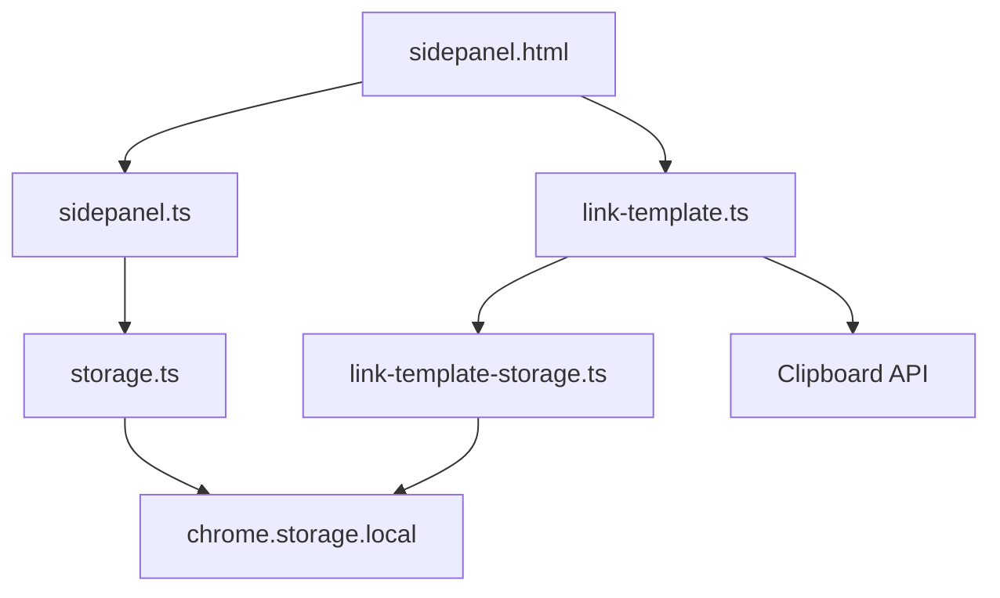
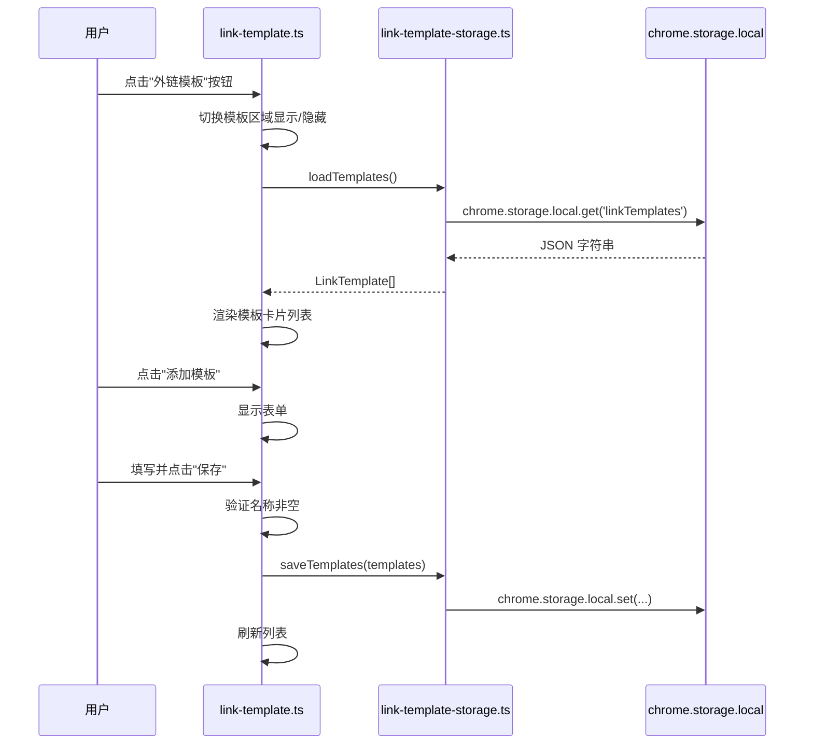

# 设计文档：外链模板管理器

## 概述

在现有 backlinks-csv-importer-extension Chrome 扩展中新增"外链模板管理"功能模块。该模块允许用户在 Side Panel 中创建、查看、编辑、删除外链模板（包含名称、网址、关键词），并支持一键复制字段值到剪贴板。模板数据通过 `chrome.storage.local` 持久化存储，与现有外链数据存储隔离。

### 设计目标

- 复用现有存储层模式（JSON 序列化 + `chrome.storage.local`），使用独立存储键 `linkTemplates`
- 新增独立的 `link-template.ts` 模块，避免修改现有 `sidepanel.ts` 的核心逻辑
- UI 风格与现有 Side Panel 保持一致（字体、颜色、圆角、间距）
- 所有 UI 文本使用中文

## 架构

### 模块划分



- `link-template-storage.ts`：模板数据的存储层，负责序列化/反序列化和 CRUD 操作
- `link-template.ts`：模板管理的 UI 逻辑，负责渲染、事件绑定、表单处理
- `sidepanel.ts`：现有主逻辑，仅在 `init()` 中调用模板模块的初始化函数
- `sidepanel.html`：新增模板管理区域的 HTML 结构
- `sidepanel.css`：新增模板相关样式

### 交互流程



## 组件与接口

### link-template-storage.ts

```typescript
/** 保存模板列表到 chrome.storage.local */
export async function saveTemplates(templates: LinkTemplate[]): Promise<void>;

/** 从 chrome.storage.local 加载模板列表，失败返回空数组 */
export async function loadTemplates(): Promise<LinkTemplate[]>;

/** 生成唯一标识符 */
export function generateId(): string;
```

### link-template.ts

```typescript
/** 初始化模板管理模块，绑定事件监听器 */
export function initTemplateManager(): Promise<void>;

/** 渲染模板列表到 DOM */
function renderTemplateList(templates: LinkTemplate[]): void;

/** 显示添加/编辑表单 */
function showForm(template?: LinkTemplate): void;

/** 隐藏表单并清空输入 */
function hideForm(): void;

/** 处理保存操作（新增或更新） */
async function handleSave(): Promise<void>;

/** 处理删除操作 */
async function handleDelete(id: string): Promise<void>;

/** 复制字段值到剪贴板 */
async function copyToClipboard(text: string, buttonEl: HTMLElement): Promise<void>;
```

### sidepanel.ts 修改

在现有 `init()` 函数末尾调用：

```typescript
import { initTemplateManager } from './link-template';
// 在 init() 末尾添加
await initTemplateManager();
```

## 数据模型

### LinkTemplate 接口

```typescript
/** 外链模板 */
export interface LinkTemplate {
  id: string;       // 唯一标识符（crypto.randomUUID() 或时间戳+随机数）
  name: string;     // 模板名称（必填，非空）
  url: string;      // 网址（可为空字符串）
  keyword: string;  // 关键词（可为空字符串）
}
```

该接口定义在 `src/types.ts` 中，与现有类型定义放在一起。

### 存储格式

- 存储键：`linkTemplates`
- 存储值：`JSON.stringify(LinkTemplate[])` — JSON 字符串
- 与现有 `backlinks` 和 `commentStatuses` 存储键完全隔离

### ID 生成策略

使用 `Date.now().toString(36) + Math.random().toString(36).slice(2, 8)` 生成唯一 ID。不使用 `crypto.randomUUID()` 是因为该 API 在某些 Chrome 扩展上下文中可能不可用。


## 正确性属性

*正确性属性是在系统所有有效执行中都应成立的特征或行为——本质上是关于系统应该做什么的形式化陈述。属性是人类可读规范与机器可验证正确性保证之间的桥梁。*

### 属性 1：存储序列化往返

*对于任意* `LinkTemplate[]` 列表，调用 `saveTemplates` 保存后再调用 `loadTemplates` 加载，应返回与原始列表相等的数据。

**验证需求：1.1**

### 属性 2：添加模板使列表增长

*对于任意* 已有模板列表和任意有效模板数据（名称非空），执行添加操作后，列表长度应增加 1，且新模板应出现在列表中。

**验证需求：2.3**

### 属性 3：名称验证拒绝空白字符串

*对于任意* 仅由空白字符组成的字符串（包括空字符串），无论是新增还是编辑场景，保存操作都应被拒绝，模板列表应保持不变。

**验证需求：2.5, 5.5**

### 属性 4：模板卡片渲染完整性

*对于任意* 模板列表，渲染后生成的卡片数量应等于模板数量，且每张卡片应包含对应模板的名称、网址、关键词值，每张卡片应包含 3 个复制按钮。

**验证需求：3.1, 3.2, 3.3**

### 属性 5：复制写入正确的值到剪贴板

*对于任意* 模板字段值，点击对应的复制按钮后，`navigator.clipboard.writeText` 应被调用且参数为该字段的精确值。

**验证需求：4.1**

### 属性 6：编辑表单预填充当前值

*对于任意* 已存在的模板，点击编辑按钮后显示的表单中，名称、网址、关键词输入框的值应分别等于该模板的当前字段值。

**验证需求：5.2**

### 属性 7：更新仅修改目标模板

*对于任意* 模板列表和列表中的任意模板，使用有效数据更新该模板后，该模板的字段应反映新值，列表中其他模板应保持不变，列表长度不变。

**验证需求：5.3**

### 属性 8：删除移除目标模板

*对于任意* 非空模板列表和列表中的任意模板，删除该模板后，列表长度应减少 1，且该模板的 ID 不应再出现在列表中。

**验证需求：6.3**

### 属性 9：切换按钮切换可见性

*对于任意* 模板区域的初始可见性状态，点击"外链模板"按钮应将可见性切换为相反状态；连续点击两次应恢复到初始状态。

**验证需求：7.2**

## 错误处理

### 存储层错误

| 场景 | 处理方式 |
|------|---------|
| `loadTemplates` 读取失败 | 返回空数组 `[]`，`console.error` 记录错误 |
| `saveTemplates` 写入失败 | 抛出 `StorageError`，调用方捕获并在控制台记录 |

### 剪贴板错误

| 场景 | 处理方式 |
|------|---------|
| `navigator.clipboard.writeText` 失败 | `console.error` 记录错误，不显示成功反馈 |

### 表单验证错误

| 场景 | 处理方式 |
|------|---------|
| 名称字段为空或仅含空白字符 | 阻止保存，显示提示"名称不能为空" |

## 测试策略

### 测试框架

- 单元测试：Jest（已有配置）
- 属性测试：fast-check（已在 devDependencies 中）
- 测试环境：`node`（存储层）/ `jsdom`（UI 逻辑）

### 单元测试

单元测试覆盖具体示例、边界情况和错误条件：

- `link-template-storage.test.ts`：
  - 保存空列表
  - 加载不存在的数据返回空数组
  - 存储读取失败返回空数组并记录错误
  - 存储写入失败抛出 StorageError
  - ID 生成唯一性

- `link-template.test.ts`（jsdom 环境）：
  - 初始化时渲染已有模板
  - 点击"添加模板"显示表单
  - 点击"取消"隐藏表单并清空输入
  - 空列表显示"暂无模板，请点击添加"
  - 复制成功后图标变为"✅"
  - 剪贴板失败时记录错误
  - 删除时显示确认对话框
  - 确认删除后刷新列表

### 属性测试

属性测试使用 fast-check 库，每个属性测试至少运行 100 次迭代。每个测试通过注释引用设计文档中的属性编号。

注释格式：`// Feature: link-template-manager, Property {N}: {属性标题}`

属性测试文件：`link-template-storage.property.test.ts` 和 `link-template.property.test.ts`

每个正确性属性由一个属性测试实现：

| 属性 | 测试文件 | 测试描述 |
|------|---------|---------|
| 属性 1：存储序列化往返 | storage property test | 生成随机 LinkTemplate[]，save 后 load 应返回相同数据 |
| 属性 2：添加模板使列表增长 | storage property test | 生成随机列表和随机有效模板，添加后长度 +1 |
| 属性 3：名称验证拒绝空白字符串 | UI property test | 生成随机空白字符串，验证保存被拒绝 |
| 属性 4：模板卡片渲染完整性 | UI property test | 生成随机模板列表，验证卡片数量和内容 |
| 属性 5：复制写入正确值 | UI property test | 生成随机字符串，验证 clipboard API 调用参数 |
| 属性 6：编辑表单预填充 | UI property test | 生成随机模板，验证表单预填值 |
| 属性 7：更新仅修改目标 | storage property test | 生成随机列表和更新数据，验证仅目标变更 |
| 属性 8：删除移除目标 | storage property test | 生成随机非空列表，删除随机元素，验证长度 -1 |
| 属性 9：切换按钮切换可见性 | UI property test | 生成随机初始状态，验证点击切换和双击恢复 |
