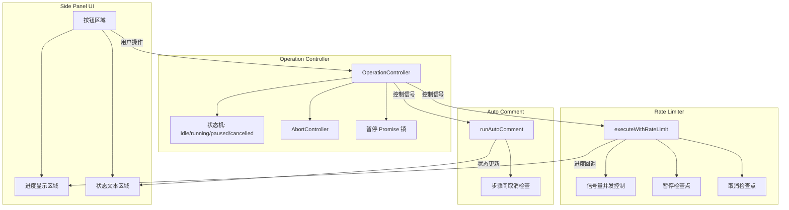
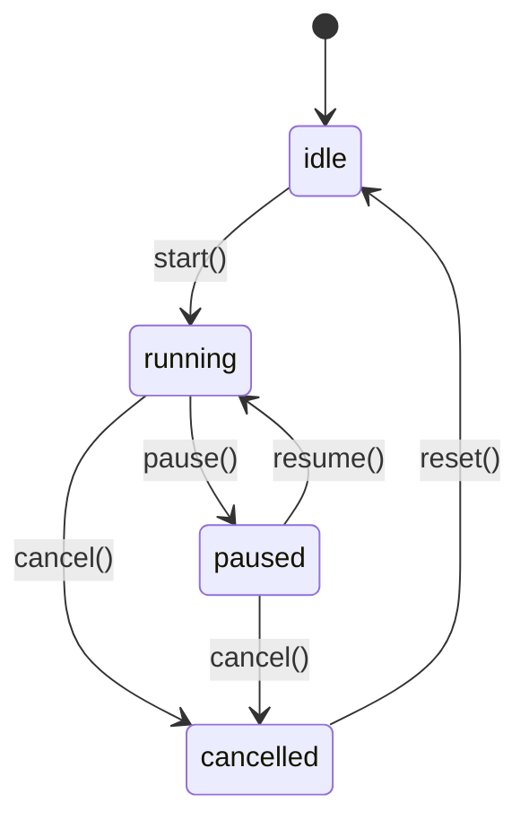

# 设计文档：暂停与取消操作

## 概述

本设计为 Backlinks CSV Importer 扩展的两个长时间运行操作（清洗 URL 分析、自动评论）添加暂停和取消功能。

核心设计思路：
- 引入 `OperationController` 状态机管理操作生命周期（idle → running → paused → idle / cancelled）
- 改造 `executeWithRateLimit` 支持外部信号控制（暂停/取消），通过 `AbortSignal` 和暂停回调实现
- 自动评论流程在每个步骤间插入取消检查点
- Side Panel UI 根据操作状态动态切换按钮文本和进度条样式

设计决策：
1. **不使用 Web Worker**：操作本身是异步 I/O 密集型，主线程不会阻塞，无需额外线程
2. **信号量模式扩展**：在现有 rate-limiter 的信号量模式上增加暂停/取消检查，改动最小
3. **清洗操作暂停保留进度，取消丢弃进度**：暂停时已完成的结果保存在内存中，取消时全部丢弃
4. **自动评论仅支持取消不支持暂停**：因为自动评论是线性多步骤流程（截图→AI分析→执行操作→验证），暂停后恢复的上下文过于复杂

## 架构



系统分为三层：
1. **UI 层（Side Panel）**：按钮事件绑定、状态文本和进度条渲染、Escape 键监听
2. **控制层（OperationController）**：管理操作状态机、提供 pause/resume/cancel API、持有 AbortController 和暂停锁
3. **执行层（Rate Limiter / Auto Comment）**：在任务执行循环中检查控制信号，响应暂停和取消

## 组件与接口

### 1. OperationController

新增模块 `src/operation-controller.ts`，管理操作生命周期。

```typescript
type OperationState = 'idle' | 'running' | 'paused' | 'cancelled';

interface OperationController {
  readonly state: OperationState;
  readonly signal: AbortSignal;

  start(): void;           // idle → running，创建新的 AbortController
  pause(): void;           // running → paused
  resume(): void;          // paused → running
  cancel(): void;          // running|paused → cancelled，调用 abort()
  reset(): void;           // any → idle

  /** 在任务循环中调用，暂停时 await 此方法会阻塞直到 resume */
  waitIfPaused(): Promise<void>;

  /** 检查是否已取消，已取消则抛出 CancelledError */
  throwIfCancelled(): void;
}
```

状态转换图：



### 2. 改造后的 Rate Limiter

`executeWithRateLimit` 新增可选参数 `controller?: OperationController`：

```typescript
export async function executeWithRateLimit<T>(
  tasks: Array<() => Promise<T>>,
  options: RateLimiterOptions,
  onProgress?: (completed: number, total: number) => void,
  controller?: OperationController,
): Promise<T[]>;
```

在每个任务执行前插入检查：
- `controller.throwIfCancelled()` — 已取消则抛出 `CancelledError`
- `await controller.waitIfPaused()` — 暂停时阻塞，resume 后继续

### 3. Auto Comment 取消支持

在 `runAutoComment` 的每个主要步骤之间插入 `controller.throwIfCancelled()` 检查点：
- Step 1（截取快照）之后
- Step 2（AI 分析）之后
- Step 3（执行操作）之前
- Step 4（验证循环）每轮开始时

特殊处理：如果在表单已提交后取消，显示警告消息。

### 4. Side Panel UI 变更

按钮状态映射：

| 操作状态 | 清洗按钮 | 取消按钮 | 自动评论按钮 |
|---------|---------|---------|------------|
| idle | 「清洗URL」可用 | 隐藏 | 「自动评论」可用 |
| cleanse running | 「暂停」 | 「取消」可见 | 禁用 |
| cleanse paused | 「继续」 | 「取消」可见 | 禁用 |
| auto-comment running | 禁用 | 隐藏 | 「取消评论」 |

进度条颜色：
- running: 默认蓝色
- paused: 黄色（`#f59e0b`）

### 5. 键盘快捷键

在 Side Panel 的 `document` 上监听 `keydown` 事件：
- 清洗运行中按 Escape → 调用 `cleanseController.pause()`
- 自动评论运行中按 Escape → 调用 `autoCommentController.cancel()`

## 数据模型

### CancelledError

自定义错误类型，用于区分取消操作和真正的运行时错误：

```typescript
class CancelledError extends Error {
  constructor(message = '操作已取消') {
    super(message);
    this.name = 'CancelledError';
  }
}
```

### OperationController 内部状态

```typescript
interface OperationControllerState {
  state: OperationState;
  abortController: AbortController | null;
  pauseResolve: (() => void) | null;  // resume 时调用此 resolver 解除暂停阻塞
}
```

### 清洗操作进度状态（暂停时保留）

暂停时需要保留的中间状态：
- `results: T[]` — 已完成任务的结果数组（由 rate-limiter 内部维护）
- `completed: number` — 已完成任务数
- `pendingTaskIndices: number[]` — 尚未执行的任务索引

这些状态在 `executeWithRateLimit` 内部自然维护，暂停只是阻塞新任务的发起，已有结果不会丢失。取消时通过 `CancelledError` 中断整个流程，调用方在 catch 中丢弃所有中间结果。

### Side Panel 新增状态变量

```typescript
// sidepanel.ts 新增
let cleanseController: OperationController;
let autoCommentController: OperationController;
```


## 正确性属性

*属性是在系统所有有效执行中都应成立的特征或行为——本质上是关于系统应该做什么的形式化陈述。属性是人类可读规范与机器可验证正确性保证之间的桥梁。*

### 属性 1：状态机转换合法性

*对于任意*操作状态和任意操作序列（start/pause/resume/cancel/reset），OperationController 的状态转换应始终遵循合法路径：idle→running、running→paused、paused→running、running→cancelled、paused→cancelled、cancelled→idle。非法转换应被忽略或抛出错误，状态不应变为未定义值。

**验证: 需求 1.2, 2.2, 3.2**

### 属性 2：暂停保留已完成进度且阻止新任务

*对于任意*任务列表和任意暂停时机，当 rate-limiter 在执行过程中被暂停时，已完成的任务结果应全部保留在结果数组中，且在暂停期间不应有新任务开始执行。

**验证: 需求 1.2, 1.4**

### 属性 3：暂停-恢复往返等价性

*对于任意*任务列表，先暂停再恢复后最终完成的结果集，应与不暂停直接执行完成的结果集完全相同（顺序和内容一致）。

**验证: 需求 1.5**

### 属性 4：取消中止执行并丢弃结果

*对于任意*任务列表和任意取消时机，当 rate-limiter 在执行过程中被取消时，应抛出 `CancelledError`，且取消后不应有新任务开始执行。

**验证: 需求 2.2, 2.4**

### 属性 5：自动评论取消阻止后续步骤

*对于任意*自动评论流程中的取消时机（步骤 N），取消后不应执行步骤 N+1 及之后的任何步骤。

**验证: 需求 3.2, 3.4, 3.5**

### 属性 6：Escape 键与按钮操作等价性

*对于任意*操作运行状态，按下 Escape 键触发的状态变更和 UI 反馈，应与点击对应按钮（暂停/取消）产生完全相同的结果。

**验证: 需求 5.3**

## 错误处理

### CancelledError 与普通错误的区分

- `CancelledError` 是预期的用户操作，不应在控制台输出错误日志
- 普通错误（网络超时、任务失败）仍按现有逻辑处理
- 在 `handleCleanse` 和 `runAutoComment` 的 catch 块中，通过 `instanceof CancelledError` 区分处理

### 取消时的网络请求处理

- `AbortController.abort()` 会触发所有使用该 signal 的 fetch 请求抛出 `AbortError`
- rate-limiter 中正在执行的任务（已发出的网络请求）会因 abort 而失败，这些错误应被静默处理
- 尚未开始的任务直接跳过

### 暂停时的超时处理

- 暂停期间，已发出的请求仍受 `timeoutMs` 限制
- 暂停不影响已发出请求的超时计时器
- 暂停只阻止新任务的发起

### 自动评论取消的特殊场景

- 在表单已提交后取消：显示警告消息而非成功/失败消息
- 在 AI 分析阶段取消：无副作用，安全取消
- 在操作执行阶段取消：已执行的 DOM 操作无法回滚，但不继续后续步骤

### 确认对话框

- 清洗操作取消前显示 `confirm()` 确认对话框
- 用户点击「取消」（confirm 返回 false）时不执行取消操作
- 自动评论取消不需要确认（因为自动评论是单次操作，影响范围小）

## 测试策略

### 测试框架

- 单元测试：Jest（已配置）
- 属性测试：fast-check（已安装，版本 ^4.5.3）
- 测试环境：jest-environment-jsdom（已配置，用于 DOM 相关测试）

### 单元测试

重点覆盖以下场景：

1. **OperationController 状态机**
   - 合法状态转换（start → pause → resume → cancel → reset）
   - 非法状态转换被正确处理（如 idle 状态下调用 pause）
   - `waitIfPaused()` 在暂停时阻塞、resume 后解除
   - `throwIfCancelled()` 在取消后抛出 CancelledError

2. **Rate Limiter 暂停/取消集成**
   - 暂停后无新任务启动
   - 恢复后继续执行剩余任务
   - 取消后抛出 CancelledError
   - 进度回调在暂停/取消时正确报告

3. **UI 状态映射**
   - 按钮文本随操作状态正确切换
   - 进度条颜色在暂停时变为黄色
   - 取消后 UI 恢复到初始状态

4. **边缘情况**
   - 取消后再次点击取消（幂等性）
   - 所有任务完成后才暂停（应直接完成）
   - 空任务列表的暂停/取消
   - 表单已提交后取消自动评论的警告消息

### 属性测试

使用 fast-check 实现，每个属性测试至少运行 100 次迭代。

每个测试用注释标注对应的设计属性：

- **Feature: pause-cancel-operations, Property 1: 状态机转换合法性** — 生成随机操作序列，验证状态机始终处于合法状态
- **Feature: pause-cancel-operations, Property 2: 暂停保留已完成进度且阻止新任务** — 生成随机任务列表和暂停时机，验证暂停行为
- **Feature: pause-cancel-operations, Property 3: 暂停-恢复往返等价性** — 生成随机任务列表，对比暂停/恢复与直接执行的结果
- **Feature: pause-cancel-operations, Property 4: 取消中止执行并丢弃结果** — 生成随机任务列表和取消时机，验证 CancelledError 抛出
- **Feature: pause-cancel-operations, Property 5: 自动评论取消阻止后续步骤** — 生成随机取消步骤索引，验证后续步骤不执行
- **Feature: pause-cancel-operations, Property 6: Escape 键与按钮操作等价性** — 生成随机操作状态，验证 Escape 和按钮产生相同结果

### 测试文件组织

```
src/__tests__/
  operation-controller.test.ts      # OperationController 单元测试 + 属性测试
  rate-limiter-pause-cancel.test.ts # Rate Limiter 暂停/取消集成测试 + 属性测试
```
