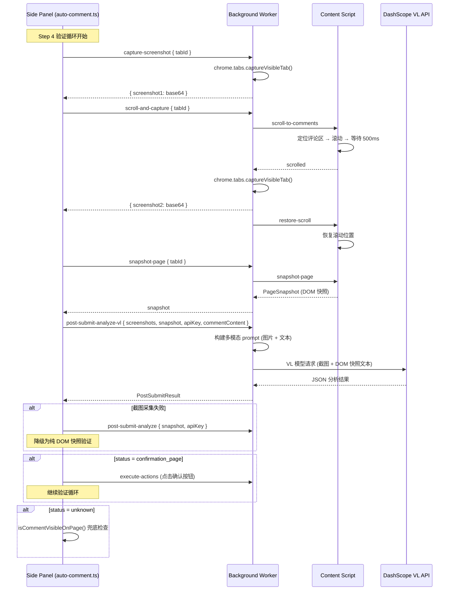
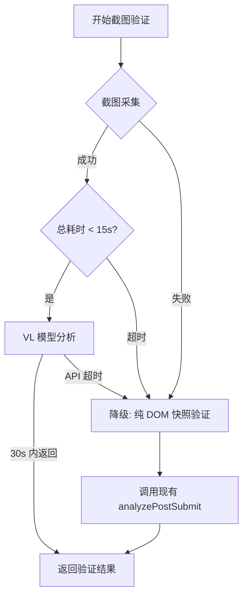

# 设计文档：截图 + DOM 快照融合验证

## 概述

当前提交后验证（Step 4）仅依赖 DOM 文本快照（`bodyExcerpt` 前 2000 字符），由纯文本模型判断提交结果。这导致大量误判——评论已成功提交但被判定为失败，因为：
- 许多网站的成功信号是视觉性的（感谢弹窗、表单清空、评论出现在列表中）
- `bodyExcerpt` 截取范围有限，可能遗漏评论区域的内容
- 纯文本模型无法"看到"页面的视觉布局和提示信息

本功能通过引入 `chrome.tabs.captureVisibleTab()` 页面截图 + VL（Vision-Language）视觉模型，让 AI 像人一样"看"页面来判断提交结果。核心策略：

1. 提交后截取当前可见区域截图（首屏）
2. Content Script 定位评论区域并滚动，截取第二张截图（评论区）
3. 将两张截图 + DOM 快照一起发送给 VL 模型进行多模态分析
4. VL 模型优先依据视觉信息判断，DOM 快照提供可操作的元素选择器
5. 截图失败时降级为现有的纯 DOM 快照验证

与现有流程的关系：本功能替换 Step 4 验证循环中的 `post-submit-analyze` 消息处理，但保留现有的重试逻辑、确认页处理和 `isCommentVisibleOnPage` 兜底检查。

## 架构

### 整体流程



### 超时与降级策略




## 组件与接口

### 1. ScreenshotCapturer（Background Worker 中）

负责调用 `chrome.tabs.captureVisibleTab()` 截取页面截图，处理压缩和大小控制。

```typescript
// 在 background.ts 中实现
interface ScreenshotResult {
  success: boolean;
  screenshot?: string;   // base64 JPEG 数据 (data:image/jpeg;base64,...)
  url?: string;          // 截图时的页面 URL
  timestamp?: number;    // 截图时间戳
  error?: string;
}

async function captureScreenshot(tabId: number): Promise<ScreenshotResult> {
  // 1. 调用 chrome.tabs.captureVisibleTab(windowId, { format: 'jpeg', quality: 80 })
  // 2. 检查 base64 数据大小是否 <= 500KB
  // 3. 如果超过 500KB，降低 quality 参数（60 → 40 → 20）重新压缩
  // 4. 附加 url 和 timestamp
  // 5. 失败时返回 { success: false, error: '...' }
}
```

### 2. CommentAreaScroller（Content Script 中）

负责定位评论区域、滚动页面、恢复滚动位置。

```typescript
// 在 content-script.ts 中实现
interface ScrollToCommentsResult {
  success: boolean;
  found: boolean;       // 是否找到评论区域
  scrolledTo: string;   // 滚动到的位置描述（'comments' | 'bottom'）
  error?: string;
}

// 评论区域选择器列表（按优先级排序）
const COMMENT_AREA_SELECTORS = [
  '#comments', '.comments', '#respond', '.comment-list',
  '#comment-area', '.comment-area', '#disqus_thread',
  '.post-comments', '#reply-title', '.comments-area',
];

async function scrollToComments(): Promise<ScrollToCommentsResult> {
  // 1. 记录当前 scrollY 位置
  // 2. 遍历 COMMENT_AREA_SELECTORS 查找评论区域
  // 3. 找到 → scrollIntoView({ behavior: 'instant' })
  // 4. 未找到 → window.scrollTo(0, document.body.scrollHeight)
  // 5. 等待 500ms
  // 6. 返回结果
}

async function restoreScrollPosition(savedPosition: number): Promise<void> {
  // window.scrollTo(0, savedPosition)
}
```

### 3. VLAnalyzer（ai-comment-generator.ts 中）

使用 VL 模型分析截图 + DOM 快照，返回与现有 `PostSubmitResult` 兼容的结果。

```typescript
// 在 ai-comment-generator.ts 中新增
interface VLAnalyzeParams {
  screenshots: string[];       // 1-2 张截图的 base64 数据
  snapshot: PageSnapshot;      // DOM 快照
  apiKey: string;
  commentContent?: string;     // 刚提交的评论内容
}

async function analyzePostSubmitWithScreenshot(
  params: VLAnalyzeParams
): Promise<PostSubmitResult> {
  // 1. 使用 currentCaptchaModel（VL 模型）
  // 2. 构建多模态消息：image_url + text
  // 3. prompt 指示模型优先看截图，DOM 快照辅助
  // 4. 设置 30s API 超时（AbortController）
  // 5. 解析返回的 JSON 为 PostSubmitResult
}
```

### 4. Post_Submit_Verifier 集成（auto-comment.ts 中）

修改 Step 4 验证循环，协调截图采集、DOM 快照和 VL 分析。

```typescript
// 在 auto-comment.ts 的 Step 4 验证循环中修改
async function captureAndVerify(
  tabId: number,
  apiKey: string,
  commentContent: string
): Promise<{ success: boolean; status?: string; actions?: AIAction[]; message?: string }> {
  const deadline = Date.now() + 15000; // 15s 总超时

  // 1. 截取首屏截图
  // 2. 滚动到评论区 + 截取第二张截图
  // 3. 恢复滚动位置
  // 4. 采集 DOM 快照
  // 5. 检查是否超时
  // 6. 调用 VL 分析（或降级到纯 DOM 分析）
}
```

### 5. 消息路由扩展（Background Worker）

新增消息 action 类型：

| Action | 方向 | 描述 |
|--------|------|------|
| `capture-screenshot` | SidePanel → BG | 截取当前可见区域截图 |
| `scroll-and-capture` | SidePanel → BG → CS | 滚动到评论区并截图 |
| `restore-scroll` | BG → CS | 恢复滚动位置 |
| `post-submit-analyze-vl` | SidePanel → BG | 带截图的 VL 验证分析 |

## 数据模型

### 新增类型定义（types.ts）

```typescript
/** 截图结果 */
export interface ScreenshotResult {
  success: boolean;
  screenshot?: string;   // base64 JPEG (data:image/jpeg;base64,...)
  url?: string;          // 截图时的页面 URL
  timestamp?: number;    // 截图时间戳 (Date.now())
  error?: string;
}

/** 截图验证请求参数 */
export interface VLVerifyPayload {
  screenshots: string[];       // 1-2 张截图 base64
  snapshot: PageSnapshot;      // DOM 快照
  apiKey: string;
  commentContent?: string;
}

/** 滚动到评论区结果 */
export interface ScrollToCommentsResult {
  success: boolean;
  found: boolean;              // 是否找到评论区域
  scrolledTo: 'comments' | 'bottom';
  previousScrollY: number;     // 滚动前的位置（用于恢复）
  error?: string;
}
```

### MessageAction 扩展

```typescript
export type MessageAction =
  | /* ...existing actions... */
  | 'capture-screenshot'
  | 'scroll-to-comments'
  | 'restore-scroll'
  | 'post-submit-analyze-vl';
```

### VL 模型 Prompt 结构

发送给 VL 模型的消息格式（多模态）：

```typescript
const messages = [
  {
    role: 'system',
    content: buildVLVerifySystemPrompt()  // 纯文本 system prompt
  },
  {
    role: 'user',
    content: [
      // 截图 1：首屏可见区域
      { type: 'image_url', image_url: { url: screenshots[0] } },
      // 截图 2：评论区域（如果有）
      ...(screenshots[1] ? [{ type: 'image_url', image_url: { url: screenshots[1] } }] : []),
      // DOM 快照文本 + 评论内容
      { type: 'text', text: buildVLVerifyUserPrompt(snapshot, commentContent) }
    ]
  }
];
```

### 截图压缩策略

```
初始质量: 80 (JPEG)
├── 大小 <= 500KB → 直接使用
├── 大小 > 500KB → 降低到 quality=60
│   ├── <= 500KB → 使用
│   └── > 500KB → 降低到 quality=40
│       ├── <= 500KB → 使用
│       └── > 500KB → 降低到 quality=20
│           ├── <= 500KB → 使用
│           └── > 500KB → 使用（接受超限，避免无限循环）
```


## 正确性属性（Correctness Properties）

*属性（Property）是在系统所有有效执行中都应成立的特征或行为——本质上是对系统应做什么的形式化陈述。属性是人类可读规格说明与机器可验证正确性保证之间的桥梁。*

### Property 1: 截图结果结构完整性

*For any* 成功的截图结果（`ScreenshotResult` 且 `success === true`），返回对象必须包含非空的 `screenshot`（base64 字符串）、非空的 `url`（页面 URL）和有效的 `timestamp`（正整数）。

**Validates: Requirements 1.1, 1.4**

### Property 2: 滚动位置恢复（Round-Trip）

*For any* 初始滚动位置 `scrollY`，执行 `scrollToComments()` 后再执行 `restoreScrollPosition(scrollY)`，最终的 `window.scrollY` 应等于初始值。

**Validates: Requirements 2.4**

### Property 3: VL Prompt 包含必要视觉信号关键词且优先截图

*For any* 由 `buildVLVerifySystemPrompt()` 生成的 system prompt，文本中必须包含以下视觉信号关键词：感谢/成功提示、评论列表、表单清空、错误提示、确认页面按钮；且必须包含指示模型优先依据截图视觉信息判断的指令。

**Validates: Requirements 3.3, 4.4**

### Property 4: 双截图消息结构正确性

*For any* 包含两张截图的 `VLAnalyzeParams`（`screenshots.length === 2`），构建的 VL API 请求消息中 `user` 角色的 `content` 数组必须包含恰好 2 个 `type: 'image_url'` 条目。

**Validates: Requirements 3.4**

### Property 5: VL 分析结果兼容 PostSubmitResult

*For any* `analyzePostSubmitWithScreenshot()` 的返回值，`status` 字段必须是 `'success' | 'error' | 'confirmation_page' | 'unknown'` 之一；若 `status === 'confirmation_page'`，则 `actions` 数组必须非空且每个 action 包含有效的 `selector` 字段。

**Validates: Requirements 3.5, 4.2**

### Property 6: 截图大小控制

*For any* `captureScreenshot()` 返回的成功结果，`screenshot` 字段的 base64 数据大小（去除 `data:image/jpeg;base64,` 前缀后的字节长度）应不超过 500KB（512000 字节）。若初始截图超过此限制，函数应通过降低 JPEG 质量参数进行重新压缩。

**Validates: Requirements 7.1, 7.2**

## 错误处理

### 截图采集失败

| 错误场景 | 处理方式 |
|----------|----------|
| `captureVisibleTab()` 抛出异常 | 返回 `{ success: false, error }`, 验证流程降级为纯 DOM 快照 |
| 截图数据为空 | 同上 |
| 压缩后仍超过 500KB | 使用最低质量（20）的截图，接受超限 |

### 滚动截图失败

| 错误场景 | 处理方式 |
|----------|----------|
| 评论区域选择器全部未匹配 | 滚动到页面底部作为替代 |
| 滚动操作异常 | 跳过第二张截图，仅使用首屏截图 |
| 恢复滚动位置失败 | 静默忽略（不影响验证结果） |

### VL 分析失败

| 错误场景 | 处理方式 |
|----------|----------|
| API 请求超时（30s） | 降级为纯 DOM 快照验证 |
| API 返回非 JSON | 降级为纯 DOM 快照验证 |
| API 返回无效 status | 返回 `{ status: 'unknown' }` |
| 总流程超时（15s） | 中断截图流程，降级为纯 DOM 快照验证 |

### 降级策略

所有截图相关的失败都不应阻断验证流程。降级路径：

```
截图 + VL 分析 → 失败 → 纯 DOM 快照 + 文本模型分析（现有 analyzePostSubmit）
```

## 测试策略

### 属性测试（Property-Based Testing）

使用 `fast-check` 库进行属性测试，每个属性测试至少运行 100 次迭代。

每个测试必须用注释标注对应的设计属性：
```typescript
// Feature: screenshot-post-verification, Property 1: 截图结果结构完整性
```

属性测试覆盖：
- Property 1: 生成随机的成功 ScreenshotResult，验证结构完整性
- Property 2: 生成随机 scrollY 值，验证滚动恢复的 round-trip
- Property 3: 调用 buildVLVerifySystemPrompt()，验证关键词存在性
- Property 4: 生成随机的 1-2 张截图输入，验证消息结构
- Property 5: 模拟 VL API 返回随机有效 JSON，验证解析结果符合 PostSubmitResult
- Property 6: 生成随机大小的 base64 数据，验证压缩后大小 <= 500KB

### 单元测试

单元测试聚焦于具体场景和边界情况：

- `captureScreenshot` 成功路径：mock `captureVisibleTab` 返回有效数据
- `captureScreenshot` 失败路径：mock API 抛出异常
- `scrollToComments` 找到评论区域：mock DOM 包含 `#comments`
- `scrollToComments` 未找到评论区域：mock 空 DOM，验证滚动到底部
- VL 分析降级：截图失败时调用 `analyzePostSubmit`
- 15s 总超时：mock 慢速截图，验证降级触发
- 30s API 超时：mock 慢速 API，验证 AbortController 生效
- 消息路由：验证 `capture-screenshot`、`scroll-to-comments`、`post-submit-analyze-vl` 消息正确路由
- 验证循环集成：验证 Step 4 循环使用新的截图验证替代旧的纯 DOM 验证
- `isCommentVisibleOnPage` 兜底：验证 unknown 状态下仍执行可见性检查

### 测试配置

```typescript
// fast-check 配置
fc.assert(
  fc.property(/* ... */),
  { numRuns: 100 }
);
```

所有 Chrome API（`chrome.tabs.captureVisibleTab`、`chrome.tabs.sendMessage` 等）在测试中使用 mock/stub 替代。
