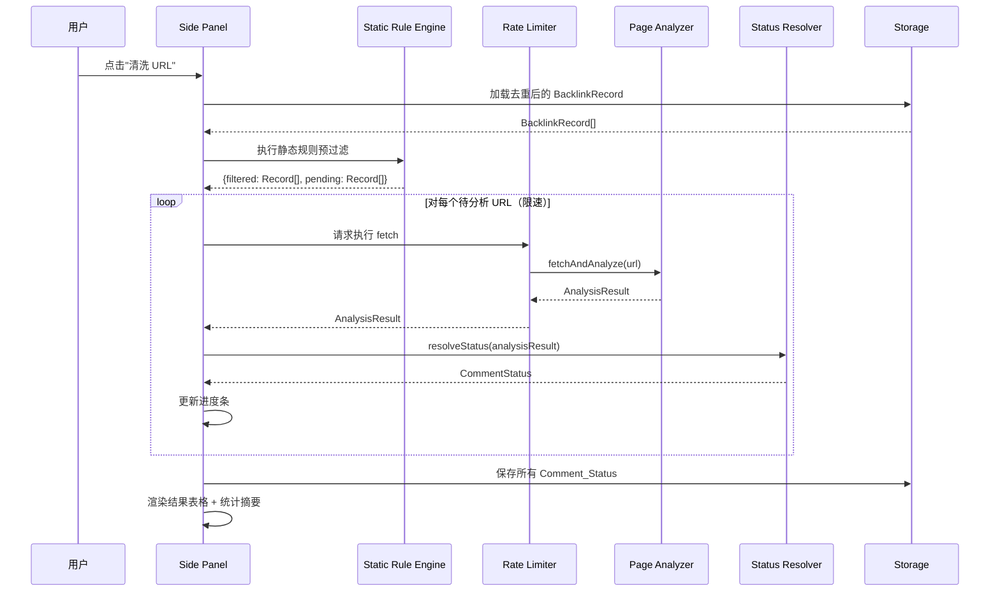

# 技术设计文档：URL 评论可用性检测

## 概述

本设计文档描述在现有 Backlinks CSV Importer Chrome 扩展上新增 URL 评论可用性检测功能的技术方案。该功能对去重后的源 URL 执行两阶段清洗：

1. **静态规则预过滤**：通过 URL 路径模式匹配，快速排除明显不可评论的页面（如用户主页、登录页、分类页等），无需网络请求。
2. **主动抓取分析**：对通过预过滤的 URL，使用 fetch API 抓取页面 HTML，通过 DOM 解析检测评论表单特征（textarea + form 组合、WordPress commentform、Disqus 等），并识别登录拦截信号。

最终为每个 URL 标注评论状态：✅ 可评论（commentable）、❌ 需登录（login_required）、⚠️ 不确定（uncertain）、🚫 已过滤（filtered_out）。

### 设计决策

1. **两阶段清洗架构**：静态规则预过滤零网络开销，可快速排除大量无效 URL，减少后续 fetch 请求量。主动抓取仅针对有潜力的 URL，提高整体效率。
2. **纯函数式核心模块**：Static_Rule_Engine 和 Page_Analyzer 的判定逻辑设计为纯函数（输入 URL/HTML → 输出状态），便于单元测试和属性测试，与 Side Panel UI 和网络层解耦。
3. **并发限速策略**：最大 3 个并发 fetch + 500ms 间隔 + 10s 超时，平衡抓取速度与目标网站友好性。使用简单的信号量模式实现，无需引入额外依赖。
4. **fetch API + redirect: "manual"**：使用 `redirect: "manual"` 选项捕获 3xx 重定向，检测重定向到登录页的情况，而非自动跟随重定向。
5. **DOMParser 解析 HTML**：使用浏览器内置 DOMParser 解析 fetch 返回的 HTML 文本，无需引入额外 HTML 解析库。在 Service Worker 中不可用 DOMParser，因此 fetch 和解析逻辑放在 Side Panel 页面上下文中执行。
6. **扩展现有数据模型**：在 BacklinkRecord 上新增可选的 `commentStatus` 字段，而非创建独立的映射表，保持数据模型的内聚性。
7. **host_permissions: \<all_urls\>**：fetch 跨域请求需要 manifest.json 中声明 `host_permissions`，使用 `<all_urls>` 覆盖所有目标域名。


## 架构

```mermaid
graph TD
    A[用户] -->|点击"清洗 URL"按钮| B[Side Panel UI]
    B -->|去重后的 BacklinkRecord 列表| C[Static Rule Engine]
    C -->|filtered_out 记录| B
    C -->|待分析 URL 列表| D[Rate Limiter]
    D -->|限速调度| E[Page Analyzer]
    E -->|fetch HTML| F[目标网站]
    E -->|分析结果| G[Status Resolver]
    G -->|Comment_Status| B
    B -->|更新状态| H[Storage 模块]
    H -->|chrome.storage.local| I[(浏览器本地存储)]
    
    B -->|进度更新| B
    B -->|状态筛选| B
    B -->|手动修改状态| H
```

### 数据流



### 模块职责

| 模块 | 文件 | 职责 |
|------|------|------|
| Static Rule Engine | `src/static-rule-engine.ts` | URL 路径模式匹配，预过滤明显不可评论的 URL |
| Page Analyzer | `src/page-analyzer.ts` | fetch 页面 HTML，解析 DOM 检测评论表单特征和登录拦截信号 |
| Status Resolver | `src/status-resolver.ts` | 综合正向信号和登录信号，判定最终 Comment_Status |
| Rate Limiter | `src/rate-limiter.ts` | 控制并发数（≤3）、请求间隔（500ms）、超时（10s） |
| Storage（扩展） | `src/storage.ts` | 新增 Comment_Status 持久化读写方法 |
| Side Panel（扩展） | `src/sidepanel.ts` | 清洗按钮、进度条、状态筛选、手动修改、结果表格 |
| Manifest（修改） | `manifest.json` | 新增 `host_permissions: ["<all_urls>"]` |


## 组件与接口

### Static Rule Engine 模块

```typescript
// src/static-rule-engine.ts

/** 预过滤排除规则：URL 路径中包含这些模式的将被标记为 filtered_out */
const EXCLUDE_PATTERNS: string[] = [
  '/profile', '/user/', '/member/',
  '/login', '/register', '/signin', '/signup',
  '/gallery', '/archive', '/category', '/tag/',
];

/** 预过滤结果 */
interface FilterResult {
  filtered: BacklinkRecord[];   // 被排除的记录
  pending: BacklinkRecord[];    // 待分析的记录
}

/**
 * 对 URL 执行静态规则匹配，判断是否应被排除
 * 匹配规则：URL 路径（pathname）中是否包含排除模式
 * 不发起任何网络请求
 */
function shouldFilter(url: string): boolean;

/**
 * 对 BacklinkRecord 列表执行批量预过滤
 * 返回被排除的记录和待分析的记录
 */
function applyStaticFilter(records: BacklinkRecord[]): FilterResult;
```

### Page Analyzer 模块

```typescript
// src/page-analyzer.ts

/** 页面分析结果（原始信号，不含最终判定） */
interface AnalysisResult {
  url: string;
  hasCommentForm: boolean;       // 检测到评论表单正向信号
  hasLoginBarrier: boolean;      // 检测到登录拦截信号
  fetchError: boolean;           // fetch 请求失败
  redirectedToLogin: boolean;    // 重定向到登录页
}

/** 评论表单正向信号检测关键词 */
const COMMENT_FORM_SELECTORS = [
  'form textarea',                    // textarea + form 组合
  '#commentform',                     // WordPress 评论表单
  '#disqus_thread',                   // Disqus 评论系统
];

const AUTHOR_INPUT_PATTERNS = ['author', 'email', 'url', 'website'];

/** 登录拦截信号文本 */
const LOGIN_BARRIER_TEXTS = [
  'log in to comment', 'sign in to comment',
  '登录后评论', '请先登录',
];

/** 登录重定向路径模式 */
const LOGIN_REDIRECT_PATTERNS = ['/login', '/signin', '/auth'];

/**
 * 抓取页面 HTML 并分析评论表单特征
 * - 使用 fetch API，redirect: "manual" 捕获重定向
 * - 超时由调用方（Rate Limiter）通过 AbortController 控制
 * - 返回原始分析信号，不做最终状态判定
 */
function fetchAndAnalyze(url: string, signal?: AbortSignal): Promise<AnalysisResult>;

/**
 * 解析 HTML 文本，检测评论表单特征（纯函数）
 * - 使用 DOMParser 解析 HTML
 * - 检测 textarea+form、WordPress commentform、Disqus
 * - 检测 author/email/url/website 输入框
 * - 检测登录拦截文本
 */
function analyzeHtml(html: string): { hasCommentForm: boolean; hasLoginBarrier: boolean };
```

### Status Resolver 模块

```typescript
// src/status-resolver.ts

type CommentStatus = 'commentable' | 'login_required' | 'uncertain' | 'filtered_out';

/**
 * 根据 AnalysisResult 综合判定最终 Comment_Status
 * 判定逻辑：
 * 1. redirectedToLogin || hasLoginBarrier → "login_required"
 * 2. hasCommentForm && !hasLoginBarrier → "commentable"
 * 3. 其他情况 → "uncertain"
 */
function resolveStatus(result: AnalysisResult): CommentStatus;
```

### Rate Limiter 模块

```typescript
// src/rate-limiter.ts

interface RateLimiterOptions {
  maxConcurrent: number;   // 最大并发数，默认 3
  delayMs: number;         // 请求间隔，默认 500ms
  timeoutMs: number;       // 单个请求超时，默认 10000ms
}

/**
 * 限速执行异步任务队列
 * - 控制最大并发数
 * - 每个任务完成后等待指定间隔
 * - 通过 AbortController 实现超时控制
 * - 通过回调报告进度
 */
function executeWithRateLimit<T>(
  tasks: Array<() => Promise<T>>,
  options: RateLimiterOptions,
  onProgress?: (completed: number, total: number) => void,
): Promise<T[]>;
```

### Storage 模块扩展

```typescript
// src/storage.ts（新增方法）

const COMMENT_STATUS_KEY = 'commentStatuses';

/** Comment_Status 映射：sourceUrl → CommentStatus */
type CommentStatusMap = Record<string, CommentStatus>;

/**
 * 保存 Comment_Status 映射到 chrome.storage.local
 */
async function saveCommentStatuses(statuses: CommentStatusMap): Promise<void>;

/**
 * 从 chrome.storage.local 加载 Comment_Status 映射
 */
async function loadCommentStatuses(): Promise<CommentStatusMap>;

/**
 * 清除所有 Comment_Status 数据
 * 在 clearRecords() 中同时调用
 */
async function clearCommentStatuses(): Promise<void>;
```

### Side Panel UI 扩展

```typescript
// src/sidepanel.ts（新增功能）

/** 清洗统计 */
interface CleansingStats {
  commentable: number;
  loginRequired: number;
  uncertain: number;
  filteredOut: number;
}

/**
 * 处理"清洗 URL"按钮点击
 * 1. 禁用按钮，显示进度条
 * 2. 执行静态规则预过滤
 * 3. 限速执行页面抓取分析
 * 4. 保存结果，更新表格
 * 5. 显示统计摘要
 */
async function handleCleanse(): Promise<void>;

/**
 * 渲染带评论状态列的表格
 * 在现有列后增加"评论状态"列
 */
function renderTableWithStatus(
  records: BacklinkRecord[],
  statuses: CommentStatusMap,
  sortColumn: string,
  sortOrder: 'asc' | 'desc',
  filterStatus: CommentStatus | 'all',
): void;

/**
 * 渲染状态筛选控件
 * 选项：全部、✅ 可评论、❌ 需登录、⚠️ 不确定、🚫 已过滤
 */
function renderStatusFilter(): void;

/**
 * 处理手动状态修改
 * 点击状态标签 → 显示下拉菜单 → 选择新状态 → 更新并持久化
 */
function handleStatusChange(url: string, newStatus: CommentStatus): Promise<void>;
```


## 数据模型

### 新增类型定义

```typescript
// src/types.ts（新增）

/** 评论可用性状态 */
type CommentStatus = 'commentable' | 'login_required' | 'uncertain' | 'filtered_out';

/** 评论状态显示标签映射 */
const COMMENT_STATUS_LABELS: Record<CommentStatus, string> = {
  commentable: '✅ 可评论',
  login_required: '❌ 需登录',
  uncertain: '⚠️ 不确定',
  filtered_out: '🚫 已过滤',
};

/** 页面分析结果 */
interface AnalysisResult {
  url: string;
  hasCommentForm: boolean;
  hasLoginBarrier: boolean;
  fetchError: boolean;
  redirectedToLogin: boolean;
}

/** 静态规则预过滤结果 */
interface FilterResult {
  filtered: BacklinkRecord[];
  pending: BacklinkRecord[];
}

/** 清洗统计摘要 */
interface CleansingStats {
  commentable: number;
  loginRequired: number;
  uncertain: number;
  filteredOut: number;
}

/** Comment_Status 映射：sourceUrl → CommentStatus */
type CommentStatusMap = Record<string, CommentStatus>;
```

### 现有类型扩展

BacklinkRecord 本身不修改。评论状态通过独立的 `CommentStatusMap`（以 `sourcePageInfo.url` 为键）存储和关联，避免修改现有数据结构影响 CSV 导入流程。

### 存储格式

评论状态以独立的 key 存储在 `chrome.storage.local` 中：

```json
{
  "backlinks": "[...现有 BacklinkRecord JSON...]",
  "commentStatuses": "{\"https://example.com/blog/post-1\":\"commentable\",\"https://example.com/forum/thread-1\":\"login_required\"}"
}
```

### Manifest 修改

```json
{
  "manifest_version": 3,
  "name": "Backlinks CSV Importer",
  "version": "1.1",
  "permissions": ["storage", "sidePanel"],
  "host_permissions": ["<all_urls>"],
  "side_panel": {
    "default_path": "sidepanel.html"
  },
  "background": {
    "service_worker": "background.js"
  }
}
```


## 正确性属性（Correctness Properties）

*属性（Property）是指在系统所有有效执行中都应保持为真的特征或行为——本质上是对系统应做什么的形式化陈述。属性是人类可读规范与机器可验证正确性保证之间的桥梁。*

### 属性 1：静态过滤分区完整性

*对于任意* BacklinkRecord 列表，执行 `applyStaticFilter` 后，`filtered` 列表长度加上 `pending` 列表长度应等于原始列表长度，且两个列表的并集应包含原始列表中的所有记录（不遗漏、不重复）。

**验证需求：1.1**

### 属性 2：排除模式匹配正确性

*对于任意* URL，若其路径（pathname）包含任一排除模式（"/profile"、"/user/"、"/member/"、"/login"、"/register"、"/signin"、"/signup"、"/gallery"、"/archive"、"/category"、"/tag/"），则 `shouldFilter(url)` 应返回 `true`。

**验证需求：1.2, 1.3, 1.4**

### 属性 3：非排除 URL 保留正确性

*对于任意* URL，若其路径（pathname）不包含任何排除模式，则 `shouldFilter(url)` 应返回 `false`，该 URL 应出现在 `applyStaticFilter` 结果的 `pending` 列表中。

**验证需求：1.5, 1.6**

### 属性 4：评论表单正向信号检测

*对于任意* HTML 文档字符串，若其中包含以下任一特征：(a) `<form>` 内嵌 `<textarea>`，(b) id 为 "commentform" 的元素，(c) id 为 "disqus_thread" 的元素，则 `analyzeHtml(html).hasCommentForm` 应为 `true`。

**验证需求：2.2, 2.4, 2.5**

### 属性 5：免登录评论输入框检测

*对于任意* HTML 文档字符串，若其中包含 `<input>` 元素且其 name 或 id 属性包含 "author"、"email"、"url"、"website" 中的任一值，则 `analyzeHtml(html).hasCommentForm` 应为 `true`。

**验证需求：2.3**

### 属性 6：登录拦截文本检测

*对于任意* HTML 文档字符串，若其文本内容包含 "log in to comment"、"sign in to comment"、"登录后评论"、"请先登录" 中的任一文本，则 `analyzeHtml(html).hasLoginBarrier` 应为 `true`。

**验证需求：2.6**

### 属性 7：评论状态综合判定正确性

*对于任意* AnalysisResult，`resolveStatus` 的返回值应满足以下优先级规则：
- 若 `redirectedToLogin` 为 true 或 `hasLoginBarrier` 为 true，则返回 "login_required"
- 否则若 `hasCommentForm` 为 true，则返回 "commentable"
- 否则返回 "uncertain"

**验证需求：3.1, 3.2, 3.3**

### 属性 8：并发限制不变量

*对于任意*任务列表，使用 `executeWithRateLimit` 执行时，任意时刻同时运行的任务数量不应超过 `maxConcurrent`（默认 3）。

**验证需求：4.1**

### 属性 9：状态筛选正确性

*对于任意* BacklinkRecord 列表、CommentStatusMap 和筛选状态值，按该状态筛选后的结果列表中每条记录的 Comment_Status 都应等于所选筛选状态；若筛选状态为 "all"，则结果列表应包含所有记录。

**验证需求：6.3, 6.4**

### 属性 10：Comment_Status 持久化往返一致性

*对于任意* CommentStatusMap，执行 `saveCommentStatuses` 保存后再执行 `loadCommentStatuses` 加载，应得到与原始映射深度相等的对象。

**验证需求：7.3, 8.1, 8.2**

### 属性 11：清除操作同时清除评论状态

*对于任意*已存储的 CommentStatusMap，执行 `clearCommentStatuses` 后，`loadCommentStatuses` 应返回空对象。

**验证需求：8.3**


## 错误处理

| 错误场景 | 处理方式 | 用户提示 |
|----------|---------|---------|
| fetch 请求网络错误 | 捕获异常，标记为 "uncertain" | 进度条继续，不中断整体流程 |
| fetch 请求超时（>10s） | AbortController 中止请求，标记为 "uncertain" | 同上 |
| fetch 返回 4xx/5xx 状态码 | 标记为 "uncertain" | 同上 |
| fetch 返回 3xx 重定向到登录页 | 标记为 "login_required" | 同上 |
| HTML 解析失败（DOMParser 异常） | 捕获异常，标记为 "uncertain" | 同上 |
| URL 格式无效（无法构造 URL 对象） | shouldFilter 返回 false，fetch 时捕获异常标记为 "uncertain" | 同上 |
| chrome.storage.local 写入失败 | 捕获异常，保留内存中的状态数据 | "评论状态保存失败，请检查浏览器存储空间" |
| chrome.storage.local 读取失败 | 捕获异常，返回空映射 | 控制台警告，UI 显示无状态数据 |
| 去重后无记录（空列表） | 不显示"清洗 URL"按钮 | 无需提示 |

### 错误处理原则

1. **不中断流程**：单个 URL 的 fetch 失败不影响其他 URL 的分析，标记为 "uncertain" 后继续处理队列。
2. **优雅降级**：网络不可用时所有 URL 标记为 "uncertain"，用户仍可手动修改状态。
3. **进度可见**：即使部分请求失败，进度条仍正常推进，用户可看到整体进展。


## 测试策略

### 双重测试方法

本功能采用单元测试与属性测试相结合的方式，确保全面覆盖：

- **单元测试**：验证具体示例、边界情况和错误条件
- **属性测试**：验证跨所有输入的通用属性

两者互补：单元测试捕获具体 bug，属性测试验证通用正确性。

### 属性测试配置

- **测试库**：使用 [fast-check](https://github.com/dubzzz/fast-check)（项目已有依赖）
- **最小迭代次数**：每个属性测试至少运行 100 次
- **标签格式**：每个测试用注释引用设计文档中的属性，格式为 `Feature: url-comment-checker, Property {number}: {property_text}`
- **一对一映射**：每个正确性属性由一个属性测试实现

### 属性测试范围

| 属性 | 测试描述 | 生成器 |
|------|---------|--------|
| P1 | 静态过滤分区完整性 | 生成随机 BacklinkRecord 列表（URL 随机包含或不包含排除模式） |
| P2 | 排除模式匹配正确性 | 生成包含排除模式的随机 URL |
| P3 | 非排除 URL 保留正确性 | 生成不包含任何排除模式的随机 URL |
| P4 | 评论表单正向信号检测 | 生成包含 textarea+form / commentform / disqus_thread 的随机 HTML |
| P5 | 免登录评论输入框检测 | 生成包含 author/email/url/website input 的随机 HTML |
| P6 | 登录拦截文本检测 | 生成包含登录拦截文本的随机 HTML |
| P7 | 评论状态综合判定正确性 | 生成随机 AnalysisResult 对象 |
| P8 | 并发限制不变量 | 生成随机长度的异步任务列表，跟踪并发数 |
| P9 | 状态筛选正确性 | 生成随机 BacklinkRecord 列表 + CommentStatusMap + 筛选状态 |
| P10 | Comment_Status 持久化往返一致性 | 生成随机 CommentStatusMap |
| P11 | 清除操作同时清除评论状态 | 生成随机 CommentStatusMap |

### 单元测试范围

单元测试聚焦于：

- **Static Rule Engine**：具体 URL 示例（如 `https://example.com/user/123` 应被过滤）、边界情况（空 URL、无路径 URL）
- **Page Analyzer**：使用 mock fetch 测试重定向到登录页（需求 2.7）、fetch 失败返回 "uncertain"（需求 2.8）、具体 WordPress/Disqus HTML 样本
- **Rate Limiter**：超时配置为 10s（需求 4.3）、具体的延迟行为验证
- **Storage**：mock chrome.storage.local 的读写操作
- **Manifest**：验证 `host_permissions` 包含 `<all_urls>`（需求 9.1）、保留 `storage` 和 `sidePanel` 权限（需求 9.2）

### 测试工具

- **测试框架**：Jest
- **属性测试库**：fast-check
- **覆盖率目标**：核心模块（Static Rule Engine、Page Analyzer、Status Resolver、Rate Limiter、Storage 扩展）≥ 90%
